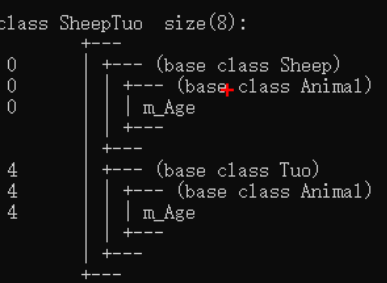
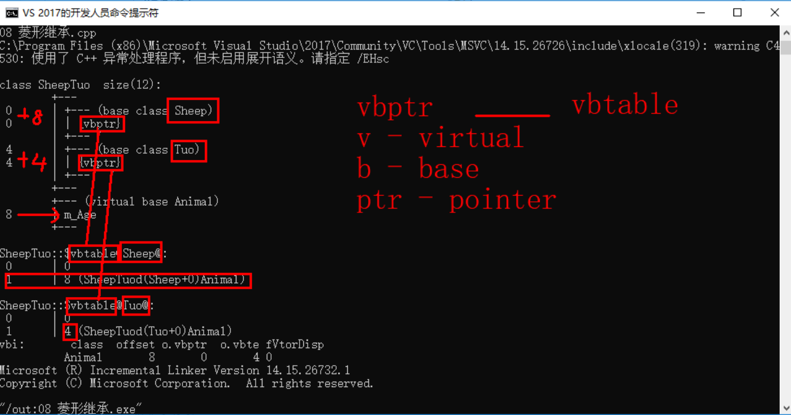

# C++核心編程

本階段主要針對C++**面向對象**編程技術做詳細講解，探討C++中的核心和精髓。

## **4** 類和對象


C++面向對象的三大特性為：**封裝、繼承、多態**


C++認為**萬事萬物都皆為對象**，對象上有其屬性和行為


**例如：**

​	人可以作為對象，屬性有姓名、年齡、身高、體重...，行為有走、跑、跳、吃飯、唱歌...

​	車也可以作為對象，屬性有輪胎、方向盤、車燈...,行為有載人、放音樂、放空調...

​	具有**相同性質的對象**，我們可以抽象稱為`類`，人屬於人類，車屬於車類

### 4.1 封裝

#### 4.1.1  封裝的意義

封裝是C++面向對象三大特性之一

封裝的意義：

* 將屬性和行為作為一個整體，表現生活中的事物
* 將屬性和行為加以權限控制
* 可以想一個道理，有人類之後才有我，有我之後才有手腳，也會有行為，像是走路，跑跳等。
* **類中的屬性和行為，我們統一稱為成員**
  * `類中的屬性`又稱為`成員屬性`或`成員變數`
  * `類中的行為`又稱為`成員函數`


**封裝意義一：**

​	在設計類的時候，屬性和行為寫在一起，表現事物

**語法：** `class 類名{   訪問權限： 屬性  / 行為  };`


**示例1**：設計一個圓類，求圓的周長

**示例代碼：**

```C++
//*********封裝的意義*********
//在設計類的時候，屬性和行為寫在一起，表現事物
//語法： class 類名{ 訪問權限： 屬性 / 行為 };
// 類中的屬性和行為，我們統一稱為成員
//`類中的屬性`又稱為`成員屬性`或`成員變數`
//`類中的行為`又稱為`成員函數`

#include<iostream>
using namespace std;

//設計一個圓類，求圓的周長
//圓求周長的公式：2*PI*半徑

//圓周率
const double PI = 3.14;

//1、封裝的意義
//將屬性和行為作為一個整體，用來表現生活中的事物

//封裝一個圓類，求圓的周長
//class代表設計一個類，後面跟著是類名稱
class Circle
{
public:  //訪問權限 - 公共的權限

	//屬性
	int m_r;//半徑

	//行為
	//獲取到圓的周長
	double calculateZC()
	{
		//2 * pi  * r
		//獲取圓的周長
		return  2 * PI * m_r;
	}
};

int main() {

	// 通過圓類，創建圓的對象
	// 實例化，通過一個類，創建一個對象的過程
	Circle c1;
	c1.m_r = 10; //給圓對象的半徑 進行賦值操作

	//2 * pi * 10 = = 62.8
	cout << "圓的周長為： " << c1.calculateZC() << endl;

	system("pause");

	return 0;
}
```


**示例2**：設計一個學生類，屬性有姓名和學號，可以給姓名和學號賦值，可以顯示學生的姓名和學號


**示例2代碼：**

```C++
//*********封裝的意義*********
//在設計類的時候，屬性和行為寫在一起，表現事物
//語法： class 類名{ 訪問權限： 屬性 / 行為 };
// 類中的屬性和行為，我們統一稱為成員
//`類中的屬性`又稱為`成員屬性`或`成員變數`
//`類中的行為`又稱為`成員函數`

#include<iostream>
using namespace std;

//學生類
class Student {
//屬性
public:
	string m_name;
	int m_id;

//行為
public:
	void setName(string name) {
		m_name = name;
	}
	void setID(int id) {
		m_id = id;
	}
	void showStudent() {
		cout << "name:" << m_name << " ID:" << m_id << endl;
	}
};

int main() {
	//創建一個具體學生
	Student stu;
	//給stu對象，進行一個賦予值的操作
	stu.setName("德瑪西亞");
	stu.setID(250);
	//顯示學生信息
	stu.showStudent();


	//創建一個具體學生
	Student stu2;
	//給stu對象，進行一個賦予值的操作
	stu.setName("李四");
	stu.setID(299);
	//顯示學生信息
	stu.showStudent();


	system("pause");

	return 0;
}
```


**封裝意義二：**

類在設計時，可以把屬性和行為放在不同的權限下，加以控制

訪問權限有三種：


1. public  公共權限 - 類內可以訪問，類外可以訪問
2. protected 保護權限 - 類內可以訪問，類外不可以訪問，兒子也可以訪問父親中的保護內容
3. private 私有權限 - 內可以訪問，類外不可以訪問，兒子不可以訪問父親中的私有內容


**示例：**

```C++
//*********封裝的意義 - 三種權限*********

#include<iostream>
using namespace std;

//三種權限
//公共權限  public 類內可以訪問，類外可以訪問
//保護權限  protected 類內可以訪問，類外不可以訪問，兒子也可以訪問父親中的保護內容
//私有權限  private 類內可以訪問，類外不可以訪問，兒子不可以訪問父親中的私有內容

class Person
{
	//姓名  公共權限
public:
	string m_Name; //姓名

	//汽車  保護權限
protected:
	string m_Car;

	//銀行卡密碼  私有權限
private:
	int m_Password;

public:
	void func()
	{
		m_Name = "張三";
		m_Car = "拖拉機";
		m_Password = 123456;
	}
};

int main() {

	Person p;
	p.m_Name = "李四";	//公共權限的內容，類外可以訪問到
	//p.m_Car = "奔馳";  //保護權限的內容，類外訪問不到
	//p.m_Password = 123; //私有權限的內容，類外訪問不到
	cout<<p.m_Name<<endl;

	//可以藉由類內的行為，改變類內的屬性
	p.func();
	cout<<p.m_Name<<endl;

	system("pause");

	return 0;
}
```


#### 4.1.2 struct和class區別


在C++中 struct和class唯一的**區別**就在於 **默認的訪問權限不同**

區別：

* struct 默認權限為公共
* class   默認權限為私有


```C++
//*********struct和class的區別*********
//struct 默認權限為公共
//class 默認權限為私有

#include<iostream>
using namespace std;

class C1
{
	int  m_A; //默認是私有權限
};

struct C2
{
	int m_A;  //默認是公共權限
};

int main() {

	C1 c1;
	c1.m_A = 10; //錯誤，訪問權限是私有，所以不能訪問

	C2 c2;
	c2.m_A = 10; //正確，訪問權限是公共，所以可以訪問

	system("pause");

	return 0;
}
```


#### 4.1.3 成員屬性設置為私有


**優點1**：將所有成員屬性設置為私有，可以自己控制讀寫權限

**優點2**：對於寫權限，我們可以檢測數據的有效性


**示例**：

```C++
//*********成員屬性設置為私有*********
//1. 可以控制讀寫權限
//2. 對於寫權限，我們可以檢測數據的有效性


#include<iostream>
using namespace std;

class Person {
public:

	//設置姓名 可寫不可讀
	void setName(string name) {
		m_Name = name;
	}

	//獲取姓名 只讀
	string getName()
	{
		return m_Name;
	}

	//獲取年齡 只讀
	int getAge() {
		return m_Age;
	}
	//設置年齡 可寫不可讀
	void setAge(int age) {
		if (age < 0 || age > 150) {
			cout << "你個老妖精!" << endl;
			return;
		}
		m_Age = age;
	}

	//情人設置為只寫
	void setLover(string lover) {
		m_Lover = lover;
	}

	//獲取情人為只讀
	string getLover() {
		return m_Lover;
	}

private:
	string m_Name; //可讀可寫  姓名
	int m_Age; //只讀  年齡
	string m_Lover; //只寫  情人
};


int main() {
	
	Person father;
	//姓名設置
	father.setName("張三");
	cout << "姓名： " << father.getName() << endl;

	//年齡設置
	father.setAge(50);
	cout << "年齡： " << father.getAge() << endl;

	//情人設置
	father.setLover("青空光");
	cout << "情人： " << father.getLover() << endl;
	//cout << "情人： " << p.m_Lover << endl;  //只寫屬性，不可以讀取

	system("pause");

	return 0;
}
```


**練習案例1：設計立方體類**

設計立方體類(Cube)

求出立方體的面積和體積

分別用全局函數和成員函數判斷兩個立方體是否相等。


```c++
//*********練習案例1 - 設計立方體類*********
//求出立方體的面積和體積
//分別用全局函數和成員函數判斷兩個立方體是否相等。

#include<iostream>
using namespace std;

class Cube {
private:
	float height;
	float width;
	float length;

public:
	//設定長寬高函數，只可以寫
	void setValues(float h, float w, float l){
		height = h;
		width = w;
		length = l;
	}

	//獲取體積數值，只可以讀
	float getVolume(){
		return height*width*length;
	}

	//獲取面積數值，只可以讀
	float getArea(){
		return height*width*2 + width*length*2 + height*length*2;
	}

	//獲取長，只可以讀
	float getLength(){
		return length;
	}

	//獲取寬，只可以讀
	float getWidth(){
		return width;
	}

	//獲取高，只可以讀
	float getHeight(){
		return height;
	}

	//利用函數成員，判斷兩個立方體是否相等
	bool isSameByClass(Cube & cube){	//用引用就不會再拷貝一份數據，比較節省空間
		if (cube.getLength() == length && cube.getWidth() == width && cube.getHeight() == height)
		{
			return true;
		}
		return false;
	}

};

//利用全局函數判斷，判斷兩個立方體是否相等
bool isSame(Cube & cube, Cube & cuboid){	
	//用引用就不會再拷貝一份數據，比較節省空間，
	//雖然函數跑完會釋放記憶體，但用引用就不會再創造新的記憶體空間
	if (cube.getLength() == cuboid.getLength() && cube.getWidth() == cuboid.getWidth() && cube.getHeight() == cuboid.getHeight())
	{
		return true;
	}
	return false;
}

int main() {

	//建立一個正方體
	Cube cube;
	//設定長寬高
	cube.setValues(20,20,20);
	//印出體積以及面積
	cout<<"cube的體積為"<<cube.getVolume()<<endl;
	cout<<"cube的面積為"<<cube.getArea()<<endl;
	

	//建立一個長方體
	Cube cuboid;
	//設定長寬高
	cuboid.setValues(20,20,20);
	//印出體積以及面積
	cout<<"cuboid的體積為"<<cuboid.getVolume()<<endl;
	cout<<"cuboid的面積為"<<cuboid.getArea()<<endl;

	//利用全局函數，判斷兩個立方體是否相等
	cout<<"兩個立方體是否相等"<<isSame(cube, cuboid)<<endl;
	cout<<"兩個立方體是否相等"<<isSame(cube, cuboid)<<endl;

	//利用函數成員，判斷兩個立方體是否相等
	cout<<"兩個立方體是否相等"<<cube.isSameByClass(cuboid)<<endl;
	cout<<"兩個立方體是否相等"<<cube.isSameByClass(cuboid)<<endl;

	system("pause");

	return 0;
};
```


**練習案例2：點和圓的關係**

設計一個圓形類（Circle），和一個點類（Point），計算點和圓的關係。


```c++
//*********練習案例2 - 點和圓的關係*********
//點到圓的距離 == 圓的半徑，及為點在圓上
//點到圓的距離 > 圓的半徑，及為點在圓外
//點到圓的距離 < 圓的半徑，及為點在圓內
//點到圓的距離 sqrt((x1-x2)^2 + (y1-y2)^2)

#include<iostream>
using namespace std;

class Point{
private:
	float point_X;
	float point_Y;

public:
	//設置X，只可寫
	void setX(float x){
		point_X = x;
	}

	//獲取X，只可讀
	float getX(){
		return point_X;
	}

	//設置Y，只可寫
	void setY(float y){
		point_Y = y;
	}

	//獲取Y，只可讀
	float getY(){
		return point_Y;
	}
};

class Circle {
private:
	float radius;
	//在類中可以讓另一個類變成成圓
	Point CenterOfCircle;

public:
	//獲取圓的資訊，只可讀
	void getCircleDetail(){
		cout<<"半徑為: "<<radius<<endl;
	}

	//設半徑，只可寫
	void setRadius(float r){
		radius = r;
	}

	//讀取半徑，只可讀
	float getRadius(){
		return radius;
	}
	
	//設圓心，只可寫
	void setCenterOfCircle(Point center){
		
		CenterOfCircle = center;
	}
	
	//獲取圓心
	Point getCenterOfCircle(){
		return CenterOfCircle;
	}
};

//判斷點和圓的關係
void isInCircle(Circle & c, Point & p){
	//計算兩點之間距離的平方
	float distance = 
	(c.getCenterOfCircle().getX()-p.getX()) * (c.getCenterOfCircle().getX()-p.getX()) 
	+ (c.getCenterOfCircle().getY() - p.getY()) * (c.getCenterOfCircle().getY() - p.getY());

	//計算半徑的平方
	float radiusTime2 = c.getRadius() * c.getRadius();

	//判斷關係
	if (distance == radiusTime2){
		cout<<"點在圓上"<<endl;
	}
	else if (distance < radiusTime2){
		cout<<"點在圓外"<<endl;
	}
	else{
		cout<<"點在圓內"<<endl;
	}
}

int main() {

	//設定圓的圓心
	Point CircleCenter;
	CircleCenter.setX(0);
	CircleCenter.setY(0);

	//設定圓c1
	Circle c1;
	c1.setCenterOfCircle(CircleCenter);

	//設定一個點
	Point p;
	p.setX(3.5);
	p.setY(4.6);

	//判斷點在圓心的什麼位置
	isInCircle(c1,p);


	system("pause");

	return 0;
};
```


### 4.2 對象的初始化和清理


*  生活中我們買的電子產品都基本會有出廠設置，在某一天我們不用時候也會刪除一些自己信息數據保證安全
*  C++中的面向對象來源於生活，每個對象也都會有初始設置以及 對象銷燬前的清理數據的設置。


#### 4.2.1 構造函數和析構函數

對象的**初始化和清理**也是兩個非常重要的安全問題

​一個對象或者變量沒有初始狀態，對其使用後果是未知

​同樣的使用完一個對象或變量，沒有及時清理，也會造成一定的安全問題

c++利用了**構造函數**和**析構函數**解決上述問題，這兩個函數將會被編譯器自動調用，完成對象初始化和清理工作。

對象的初始化和清理工作是編譯器強制要我們做的事情，因此如果**我們不提供構造和析構，編譯器會提供**

**編譯器提供的構造函數和析構函數是空實現。**


* 構造函數：主要作用在於創建對象時為對象的成員屬性賦值，構造函數由編譯器自動調用，無須手動調用。
* 析構函數：主要作用在於對象**銷燬前**系統自動調用，執行一些清理工作。


**構造函數語法：**`類名(){}`

1. 構造函數，沒有返回值也不寫void
2. 函數名稱與類名相同
3. 構造函數可以有參數，因此可以發生重載
4. 程序在調用對象時候會自動調用構造，無須手動調用,而且只會調用一次


**析構函數語法：** `~類名(){}`

1. 析構函數，沒有返回值也不寫void
2. 函數名稱與類名相同,在名稱前加上符號  ~
3. 析構函數不可以有參數，因此不可以發生重載
4. 程序在對象銷燬前會自動調用析構，無須手動調用,而且只會調用一次


```C++
//*********構造函數與析構函數*********

#include<iostream>
using namespace std;

class Person
{
public:
	//1. 構造函數，進行初始化操作
    //沒有返回值，不用寫void
    //函數名與類名相同
    //構造函數可以有參數，可以發生重載
    //創建對象的時候，構造函數會自動調用，而且只會調用一次
	Person()
	{
		cout << "Person的構造函數調用" << endl;
	}

	//2. 析構函數，進行清理操作
    //沒有返回值，不用寫void
    //函數名與類名相同，但要在前面有`~`
    //析構函數可以不可以有參數，所以不可以發生重載
    //對象在銷毀前，會自動調用析構函數，而且只會調用一次
	~Person()
	{
		cout << "Person的析構函數調用" << endl;
	}

};

//構造函數和析構函數都是必須有的，如果我們沒有去撰寫構造函數和析構函數
//編譯器會自動提供一個空的構造函數和析構函數
void test01()
{
	Person p;   //在棧上的數據，test01執行完畢後，會自動釋放這個對象
}

int main() {
	
	test01();

	system("pause");

	return 0;
}
```


#### 4.2.2 構造函數的分類及調用

**兩種分類方式：**

* ​按參數分為： 有參構造和無參構造
* 按類型分為： 普通構造和拷貝構造

**三種調用方式：**
* ​括號法
* ​顯示法
* 隱式轉換法


**示例：**

```C++
//*********構造函數的分類與調用*********
//注意1：調用無參構造函數不能加括號，如果加了編譯器認為這是一個函數聲明，因為如果加括號，編譯器會以為你在做函數聲明


#include<iostream>
using namespace std;

//1、構造函數分類
// 按照參數分類分為 有參和無參構造   無參又稱為默認構造函數
// 按照類型分類分為 普通構造和拷貝構造

class Person {
public:
	//無參（默認）構造函數
	Person() {
		cout << "無參構造函數!" << endl;
	}
	//有參構造函數
	Person(int a) {
		age = a;
		cout << "有參構造函數!" << endl;
	}
	//拷貝構造函數
	Person(const Person & p) {
		//將傳入的人身上的所有屬性，拷貝到我身上
		age = p.age;
		cout << "拷貝構造函數!" << endl;
	}
	//析構函數
	~Person() {
		cout << "析構函數!" << endl;
	}
public:
	int age;
};

//2、構造函數的調用
//調用無參構造函數
void test01() {
	//注意1：調用無參構造函數不能加括號，如果加了編譯器認為這是一個函數聲明，因為如果加括號，編譯器會以為你在做函數聲明
	//Person p();  //絕對不可以這樣寫，因為看起來在做函數聲明;
	Person p; //調用無參構造函數
}

//調用有參的構造函數
void test02() {

	//2.1  括號法，常用
	//注意1：調用無參構造函數不能加括號，如果加了編譯器認為這是一個函數聲明
	//Person p();  //絕對不可以這樣寫，因為看起來在做函數聲明;
	Person p;	//調用無參構造函數
	Person p1(10);	//調用有參構造函數
	Person p2(p1);	//調用拷貝構造函數
	cout<<p1.age<<endl;
	cout<<p2.age<<endl;


	//2.2 顯式法
	Person p3 = Person(10); 	//有參構造
	Person p4 = Person(p3);		//無參構造
	//Person(10);		//單獨寫就是匿名對象  當前行結束之後，馬上析構

	//注意2：不能利用 拷貝構造函數 初始化匿名對象 編譯器認為是對象聲明，Person (p4) === Person p4，
	//Person (p4);
	

	//2.3 隱式轉換法
	Person p5 = 10; // Person p4 = Person(10); 
	Person p6 = p5; // Person p5 = Person(p4); 

	//注意2：不能利用 拷貝構造函數 初始化匿名對象 編譯器認為是對象聲明
	//Person p5(p4);
}

int main() {

	//test01();
	test02();

	system("pause");

	return 0;
}
```


#### 4.2.3 拷貝構造函數調用時機


C++中拷貝構造函數調用時機通常有三種情況

* 使用一個已經創建完畢的對象來初始化一個新對象
* 值傳遞的方式給函數參數傳值
* 以值方式返回局部對象


**示例：**

```C++
//*********拷貝構造函數的調用時機*********


#include<iostream>
using namespace std;

class Person {
public:
	Person() {
		cout << "無參構造函數!" << endl;
		mAge = 0;
	}
	Person(int age) {
		cout << "有參構造函數!" << endl;
		mAge = age;
	}
	Person(const Person& p) {
		cout << "拷貝構造函數!" << endl;
		mAge = p.mAge;
	}
	//析構函數在釋放內存之前調用
	~Person() {
		cout << "析構函數!" << endl;
	}
public:
	int mAge;
};

//1. 使用一個已經創建完畢的對象來初始化一個新對象
void test01() {

	Person man(100); //p對象已經創建完畢
	Person newman(man); //調用拷貝構造函數
	Person newman2 = man; //拷貝構造

	//Person newman3;
	//newman3 = man; //不是調用拷貝構造函數，賦值操作
}

//2. 值傳遞的方式給函數的參數傳值
//相當於Person p1 = p;
void doWork(Person p1) {}	//值傳遞給形參等於是拷貝一個
void test02() {
	Person p; //無參構造函數
	doWork(p);
}

//3. 以值方式返回局部對象
Person doWork2()
{
	Person p1;
	cout << (int *)&p1 << endl;		//查看p1的地址
	return p1;
}

void test03()
{
	Person p = doWork2();
	cout << (int *)&p << endl;		//查看p的地址
}


int main() {

	//test01();
	//test02();
	test03();

	system("pause");

	return 0;
}
```


#### 4.2.4 構造函數調用規則

默認情況下，c++編譯器至少給一個類添加3個函數

1．默認構造函數(無參，函數體為空)

2．默認析構函數(無參，函數體為空)

3．默認拷貝構造函數，對屬性進行值拷貝


構造函數調用規則如下：

* 如果用戶定義`有參構造函數`，c++不再提供默認`無參構造函數`，但是會提供`默認拷貝構造`


* 如果用戶定義`拷貝構造函數`，c++不會再提供`其他默認構造函數`


示例：

```C++
//*********構造函數的調用規則*********

#include<iostream>
using namespace std;

//1. 只要創建一個類，c++編譯器會自動給每個類添加三個函數
//默認構造（空實現）
//析構函數（空實現）
//拷貝函數（值拷貝）

//2. 如果我們寫了有參構造函數，則編譯器則不會有默認無參構造函數
//如果我們提供了拷貝構造函數，則編譯器就不提供其他所有的默認函數

class Person {
public:
	//無參（默認）構造函數
	Person() {
		cout << "無參構造函數!" << endl;
	}
	//有參構造函數
	Person(int a) {
		age = a;
		cout << "有參構造函數!" << endl;
	}
	//拷貝構造函數
	Person(const Person& p) {
		age = p.age;
		cout << "拷貝構造函數!" << endl;
	}
	//析構函數
	~Person() {
		cout << "析構函數!" << endl;
	}
public:
	int age;
};

void test01()
{
	Person p1(18);
	//如果不寫拷貝構造，編譯器會自動添加拷貝構造，並且做淺拷貝操作
	Person p2(p1);

	cout << "p2的年齡為： " << p2.age << endl;
}

void test02()
{
	//如果用戶提供有參構造，編譯器不會提供默認構造，但依然會提供拷貝構造
	Person p1; //此時如果用戶自己沒有提供默認構造，會出錯
	Person p2(10); //用戶提供的有參
	Person p3(p2); //此時如果用戶沒有提供拷貝構造，編譯器會提供

	//如果用戶提供拷貝構造，編譯器不會提供其他默認構造函數
	Person p4; //此時如果用戶自己沒有提供默認構造，會出錯
	Person p5(10); //此時如果用戶自己沒有提供有參，會出錯
	Person p6(p5); //用戶自己提供拷貝構造
}

int main() {

	test01();

	system("pause");

	return 0;
}
```


#### 4.2.5 深拷貝與淺拷貝


深淺拷貝是面試經典問題，也是常見的一個坑


淺拷貝：簡單的賦值拷貝操作


深拷貝：在堆區重新申請空間，進行拷貝操作


**示例：**

```C++
//*********深拷貝與淺拷貝*********
//總結：如果屬性有在堆區開闢的，一定要自己提供拷貝構造函數，防止淺拷貝帶來的問題

#include<iostream>
using namespace std;

class Person {
public:
	//無參（默認）構造函數
	Person() {
		cout << "無參構造函數!" << endl;
	}
	//有參構造函數
	Person(int age ,int height) {
		
		cout << "有參構造函數!" << endl;

		m_age = age;
		m_height = new int(height);
		cout<<(int)&m_age<<endl;		//查看地址
		cout<<(int)m_height<<endl;		//查看堆區地址
	}
	//拷貝構造函數  
	Person(const Person& p) {
		cout << "拷貝構造函數!" << endl;
		//如果不利用深拷貝在堆區創建新內存，會導致淺拷貝帶來的重複釋放堆區問題
		m_age = p.m_age;
		m_height = new int(*p.m_height);
		cout<<(int)&m_age<<endl;		//查看地址
		cout<<(int)m_height<<endl;		//查看堆區地址
	}

	//析構函數
	//將堆區開闢的數據做釋放操作
	~Person() {
		cout << "析構函數!" << endl;
		if (m_height != NULL)
		{
			delete m_height;
		}
	}
public:
	int m_age;
	int* m_height;
};

void test01()
{
	Person p1(18, 180);

	Person p2(p1);

	cout << "p1的年齡： " << p1.m_age << " 身高： " << *p1.m_height << endl;

	cout << "p2的年齡： " << p2.m_age << " 身高： " << *p2.m_height << endl;

}

int main() {

	test01();

	system("pause");

	return 0;
}
```

> 總結：如果屬性有在堆區開闢的，一定要自己提供拷貝構造函數，防止淺拷貝帶來的問題


#### 4.2.6 初始化列表


**作用：**

C++提供了初始化列表語法，用來初始化屬性

當然，你也可以用機構函數來做初始化，初始化列表只是另一種初始化的方式


**語法：**`構造函數()：屬性1(值1),屬性2（值2）... {}`


**示例：**

```C++
//*********初始化列表*********
//作用：C++提供了初始化列表語法，用來初始化屬性
//當然，你也可以用傳統方式來做初始化
//這只是另一種初始化的方式
//語法：構造函數()：屬性1(值1),屬性2（值2）... {}

#include<iostream>
using namespace std;

class Person {
public:

	////傳統方式初始化
	//Person(int a, int b, int c) {
	//	m_A = a;
	//	m_B = b;
	//	m_C = c;
	//}

	//初始化列表方式初始化
	Person(int a, int b, int c) :m_A(a), m_B(b), m_C(c) {}
	void PrintPerson() {
		cout << "mA:" << m_A << endl;
		cout << "mB:" << m_B << endl;
		cout << "mC:" << m_C << endl;
	}
private:
	int m_A;
	int m_B;
	int m_C;
};

int main() {

	Person p(1, 2, 3);
	p.PrintPerson();

	system("pause");

	return 0;
}
```


#### 4.2.7 類對象作為類成員


C++類中的成員可以是另一個類的對象，我們稱該成員為 對象成員


例如：

```C++
class A {}
class B
{
    A a；
}
```


B類中有對象A作為成員，A為對象成員


那麼當創建B對象時，A與B的構造和析構的順序是誰先誰後？


**示例：**

```C++
//*********類對象作為類成員*********
//C++類中的成員可以是另一個類的對象，我們稱該成員為 對象成員
//那麼當創建B對象時，A與B的構造和析構的順序是誰先誰後？

#include<iostream>
using namespace std;

//手機類
class Phone
{
public:
	Phone(string name)
	{
		m_PhoneName = name;
		cout << "Phone構造" << endl;
	}

	~Phone()
	{
		cout << "Phone析構" << endl;
	}

	//手機品牌名稱
	string m_PhoneName;

};

//人類
class Person
{
public:

	//初始化列表可以告訴編譯器調用哪一個構造函數
	Person(string name, string pName) :m_Name(name), m_Phone(pName)		//Phone m_Phone = pName 隱式轉換法
	{
		cout << "Person構造" << endl;
	}

	~Person()
	{
		cout << "Person析構" << endl;
	}

	void playGame()
	{
		cout << m_Name << " 使用" << m_Phone.m_PhoneName << " 牌手機! " << endl;
	}

	string m_Name;
	Phone m_Phone;

};

void test01()
{
	//當類中成員是其他類對象時，我們稱該成員為 對象成員
	//構造的順序是 ：先調用對象成員的構造，再調用本類構造
	//析構順序與構造相反
	Person p("張三" , "蘋果X");
	p.playGame();

}

int main() {

	test01();

	system("pause");

	return 0;
}
```


#### 4.2.8 靜態成員

靜態成員就是在成員變量和成員函數前加上關鍵字static，稱為靜態成員

靜態成員分為：


*  靜態成員變量
   *  所有對象共享同一份數據
   *  在編譯之前就已經分配內存，並分配在全局區
   *  類內聲明，類外初始化
*  靜態成員函數
   *  所有對象共享同一個函數
   *  靜態成員函數只能訪問靜態成員變量


**示例1** ：靜態成員變量

```C++
//*********靜態成員變量*********

#include<iostream>
using namespace std;

//人類
class Person
{
	
public:

	static int m_A; //靜態成員變量

	//靜態成員變量特點：
	//1 在編譯之前就已經分配內存，並分配在全局區
	//2 類內聲明，類外初始化
	//3 所有對象共享同一份數據

//靜態成員變量也是有訪問權限的
private:
	static int m_B; 
};

int Person::m_A = 10;
int Person::m_B = 10;

void test01()
{
	//靜態成員變量兩種訪問方式

	//1、通過對象
	Person p1;
	p1.m_A = 100;
	cout << "p1.m_A = " << p1.m_A << endl;

	Person p2;
	p2.m_A = 200;
	cout << "p1.m_A = " << p1.m_A << endl; //共享同一份數據
	cout << "p2.m_A = " << p2.m_A << endl;

	//2、通過類名
	cout << "m_A = " << Person::m_A << endl;


	//cout << "m_B = " << Person::m_B << endl; //私有權限訪問不到
}

void test02(){
	//靜態成員變亮不屬於某個對象上，所有對象都共享同一份數據
	//因此靜態成員變量有兩種訪問方式

	//1. 通過對象進行訪問
	Person p;
	cout<<p.m_A<<endl;

	//2. 通過類名進行訪問
	cout<<Person::m_A<<endl;

	//cout << "m_B = " << Person::m_B << endl; //私有權限訪問不到

}

int main() {

	test02();

	system("pause");

	return 0;
}
```


**示例2**：靜態成員函數

```C++
//*********靜態成員函數*********

#include<iostream>
using namespace std;

class Person
{

public:

	//靜態成員函數特點：
	//1 所有對象共享一個函數
	//2 靜態成員函數只能訪問靜態成員變量
	
	static void func()
	{
		cout << "func調用" << endl;
		m_A = 100;	//靜態成員函數可以訪問靜態成員變量
		//m_B = 100; //錯誤，不可以訪問非靜態成員變量，無法缺分到底是哪個對象的m_B
	}

	static int m_A; //靜態成員變量
	int m_B; // 
private:

	//靜態成員函數也是有訪問權限的
	static void func2()
	{
		cout << "func2調用" << endl;
	}
};
int Person::m_A = 10;


void test01()
{
	//靜態成員變量兩種訪問方式

	//1、通過對象進行訪問
	Person p1;
	p1.func();

	//2、通過類名進行訪問
	Person::func();


	//Person::func2(); //類外訪問不到私有權限的靜態函數
}

int main() {

	test01();

	system("pause");

	return 0;
}
```


### 4.3 C++對象模型和this指針


#### 4.3.1 成員變量和成員函數分開存儲


在C++中，類內的成員變量和成員函數分開存儲

只有非靜態成員變量才屬於類的對象上


```C++
//*********成員變量和成員函數分開存儲*********
//在C++中，類內的成員變量和成員函數分開存儲
//只有非靜態成員變量才屬於類的對象上

#include<iostream>
using namespace std;

class Person {
public:
	Person() {
		mA = 0;
	}
	//非靜態成員變量佔對象空間
	int mA;
	//靜態成員變量不佔對象空間
	static int mB; 
	//函數也不佔對象空間，所有函數共享一個函數實例
	void func() {
		cout << "mA:" << this->mA << endl;
	}
	//靜態成員函數也不佔對象空間
	static void sfunc() {
	}
};

int Person::mB = 10;

class cat{
	
};

void test(){
	//空對象佔用內存空間為1
	//c++編譯器會給每個空對象也分配一個字節的空間，是為了區分空對象佔內存的位置
	//每個空對象，也應該有獨一無二的內存地址
	cat c1;
	cout<<"空對象c1的大小為多少：" <<sizeof(c1)<<endl;
};

int main() {

	test();

	Person p;
	cout << "Person類的大小為" <<sizeof(Person) << endl;		//因mA的大小有4byte，所以Person類的大小為4byte
	cout<<"p的地址為：" <<(int)&p<<endl;
	cout<<"p.mA的地址為："<<(int)&p.mA<<endl;
	cout<<"靜態變量`mB`的地址為："<<(int) & Person::mB<<endl;

	system("pause");

	return 0;
}
```


#### 4.3.2 this指針概念

通過4.3.1我們知道在C++中成員變量和成員函數是分開存儲的

每一個非靜態成員函數只會誕生一份函數實例，也就是說多個同類型的對象會共用一塊代碼

那麼問題是：這一塊代碼是如何區分那個對象調用自己的呢？


c++通過提供特殊的對象指針，this指針，解決上述問題。**this指針指向被調用的成員函數所屬的對象**

**注意**：這個章節很難，要多看多瞭解

this指針是隱含每一個非靜態成員函數內的一種指針

this指針不需要定義，直接使用即可


this指針的用途：

*  當形參和成員變量同名時，可用this指針來區分
*  在類的非靜態成員函數中返回對象本身，可使用return *this

```C++
//*********this指針概念*********
//這個章節很難，要多看多瞭解

#include<iostream>
using namespace std;

class Person
{
public:

	Person(int age)
	{
		//1、當形參和成員變量同名時，可用this指針來區分
		//this指針指向被調用的成員函數 所屬的對象
		//this === Person * p1
		this->age = age;
	}

	Person & PersonAddAge(Person p)
	{
		this->age += p.age;

		//this指向的是p2的指針，而*this指向的就是p2的本體 
		return *this;
	}

	int age;
};

//1. 解決名稱衝突
void test01()
{
	Person p1(10);
	cout << "p1.age = " << p1.age << endl;
}

//2. 返回對象本身*this
void test02()
{
	Person p1(10);
	cout << "p1.age = " << p1.age << endl;

	Person p2(10);
	p2.PersonAddAge(p1).PersonAddAge(p1).PersonAddAge(p1);	//這是鏈式編程思想
	cout << "p2.age = " << p2.age << endl;
}


int main() {

	test01();
	//test02();

	system("pause");

	return 0;
}
```


#### 4.3.3 空指針訪問成員函數


C++中空指針也是可以調用成員函數的，但是也要注意有沒有用到this指針


如果用到this指針，需要加以判斷保證代碼的健壯性


**示例：**

```C++
//*********空指針訪問成員函數*********

#include<iostream>
using namespace std;

//空指針訪問成員函數
class Person {
public:

	void ShowClassName() {
		cout << "我是Person類!" << endl;
	}

	void ShowPerson() {
		cout << mAge << endl;
    //會報錯，因為你是用空指針，根本沒有對象去掉用mAge，因為在mAge的程式背後是this->mAge，甚至你可以直接將mAge改成this->mAge
	}

public:
	int mAge;	//前面的m代表是member，就是成員
};

void test01()
{
	Person * p = NULL;
	p->ShowClassName(); //空指針，可以調用成員函數
	p->ShowPerson();  //但是如果成員函數中用到了this指針，就不可以了
}

int main() {

	test01();

	system("pause");

	return 0;
}
```
OUTPUT報錯
```
我是Person類!
signal: illegal instruction (core dumped)
```

這樣寫就不會報錯了
```C++
//*********空指針訪問成員函數*********

#include<iostream>
using namespace std;

//空指針訪問成員函數
class Person {
public:

	void ShowClassName() {
		cout << "我是Person類!" << endl;
	}

	void ShowPerson() {
		if (this == NULL) {
			return;
		}
		cout << mAge << endl;
	}

public:
	int mAge;	//前面的m代表是member，就是成員
};

void test01()
{
	Person * p = NULL;
	p->ShowClassName(); //空指針，可以調用成員函數
	p->ShowPerson();  //但是如果成員函數中用到了this指針，就不可以了
}

int main() {

	test01();

	system("pause");

	return 0;
}
```


#### 4.3.4 const修飾成員函數


**常函數：**

* 成員函數後加const後我們稱為這個函數為**常函數**
* 常函數內不可以修改成員屬性
* 成員屬性聲明時加關鍵字mutable後，在常函數中依然可以修改


**常對象：**

* 聲明對象前加const稱該對象為常對象
* 常對象只能調用常函數


**示例：**

```C++
//*********const修飾成員函數*********

#include<iostream>
using namespace std;

class Person {
public:
	Person() {
		m_A = 0;
		m_B = 0;
	}

	//常量函數
	//this指針的本質是一個指針常量，指針的指向不可修改
	//如果想讓指針指向的值也不可以修改，需要聲明常函數
	//在成員函數後面加上const，修飾的是this指向，讓指針指向的值都不可以修改
	void ShowPerson() const {
		//const Person * const this; 這代表指針的指向跟裡面的值都不能修改
		//this = NULL; //不能修改指針的指向 Person* const this;
		//this->mA = 100; //但是this指針指向的對象的數據是可以修改的
		

		//const修飾成員函數，表示指針指向的內存空間的數據不能修改，除了mutable修飾的變量
		this->m_B = 100;
	}

	void MyFunc() {		
		//m_A = 10000;
		cout<<"我調用了MyFunc"<<endl;
	}

public:
	int m_A;
	mutable int m_B; //特殊關鍵字mutable，加上這個關鍵字，即使在常量函數中，也可以修改這個值
};

//const修飾對象  常量對象
void test01() {

	const Person person; //常量對象  
	cout << person.m_A << endl;
	//person.mA = 100; //常量對象 不能修改成員變量的值,但是可以訪問
	person.m_B = 100; //m_B因為有加上mutable關鍵字，所以可以修改他

	//常量對象 只能調用常量函數
	person.MyFunc();
}

int main() {

	test01();

	system("pause");

	return 0;
}
```
OUTPUT
報錯，因為常量對象不能調用一般函數，常量對象只能調用常量函數
```
tempCodeRunnerFile.cpp: In function 'void test01()':
tempCodeRunnerFile.cpp:46:16: error: passing 'const Person' as 'this' argument discards qualifiers [-fpermissive]
  person.MyFunc();
                ^
tempCodeRunnerFile.cpp:27:7: note:   in call to 'void Person::MyFunc()'
  void MyFunc() {
       ^~~~~~
```
這樣寫就成功編譯了
```C++
//*********const修飾成員函數*********

#include<iostream>
using namespace std;

class Person {
public:
	Person() {
		m_A = 0;
		m_B = 0;
	}

	//常量函數
	//this指針的本質是一個指針常量，指針的指向不可修改
	//如果想讓指針指向的值也不可以修改，需要聲明常函數
	//在成員函數後面加上const，修飾的是this指向，讓指針指向的值都不可以修改
	void ShowPerson() const {
		//const Person * const this; 這代表指針的指向跟裡面的值都不能修改
		//this = NULL; //不能修改指針的指向 Person* const this;
		//this->mA = 100; //但是this指針指向的對象的數據是可以修改的
		

		//const修飾成員函數，表示指針指向的內存空間的數據不能修改，除了mutable修飾的變量
		this->m_B = 100;
	}

	void MyFunc() const{		
		//m_A = 10000;
		cout<<"我調用了MyFunc"<<endl;
	}

public:
	int m_A;
	mutable int m_B; //特殊關鍵字mutable，加上這個關鍵字，即使在常量函數中，也可以修改這個值
};

//const修飾對象  常量對象
void test01() {

	const Person person; //常量對象  
	cout << person.m_A << endl;
	//person.mA = 100; //常量對象 不能修改成員變量的值,但是可以訪問
	person.m_B = 100; //m_B因為有加上mutable關鍵字，所以可以修改他

	//常量對象 只能調用常量函數
	person.MyFunc();
}

int main() {

	test01();

	system("pause");

	return 0;
}
```
OUTPUT
```
0
我調用了MyFunc
```


### 4.4 友元


生活中你的家有客廳(Public)，有你的臥室(Private)

客廳所有來的客人都可以進去，但是你的臥室是私有的，也就是說只有你能進去

但是呢，你也可以允許你的好閨蜜好基友進去。


在程序裡，有些私有屬性 也想讓類外特殊的一些函數或者類進行訪問，就需要用到友元的技術


友元的目的就是讓一個函數或者類 訪問另一個類中私有成員


友元的關鍵字為  ==friend==


友元的三種實現

* 全局函數做友元
* 類做友元
* 成員函數做友元


#### 4.4.1 全局函數做友元
**input**
```C++
//*********全局函數做友元*********

#include<iostream>
using namespace std;

//建築物類
class Building
{
public:

	Building()
	{
		this->m_SittingRoom = "客廳";
		this->m_BedRoom = "臥室";
	}

public:
	string m_SittingRoom; //客廳

private:
	string m_BedRoom; //臥室
};

void goodGay(Building * building)	//goodGay = 好基友
{
	cout << "好基友的全局函數正在訪問building->m_SittingRoom： " << building->m_SittingRoom << endl;
	cout << "好基友的全局函數正在訪問building->m_BedRoom： " << building->m_BedRoom << endl;
}


void test01()
{
	Building b;
	goodGay(&b);
}

int main(){

	test01();

	system("pause");
	return 0;
}
```
**output**
報錯，因為在類外訪問私有屬性
```
./main.cpp:32:85: error: 'm_BedRoom' is a private member of 'Building'
        cout << "好基友的全局函數正在訪問building->m_BedRoom： " << building->m_BedRoom << endl;
                                                                              ^
./main.cpp:25:9: note: declared private here
        string m_BedRoom; //臥室
```
**input**
將全局函數變成Building的好朋友，即可以訪問
```c++
//*********全局函數做友元*********

#include<iostream>
using namespace std;

//建築物類
class Building
{
	//告訴編譯器 goodGay全局函數 是 Building類的好朋友，可以訪問類中的私有內容
	friend void goodGay(Building * building);

public:

	Building()
	{
		this->m_SittingRoom = "客廳";
		this->m_BedRoom = "臥室";
	}

public:
	string m_SittingRoom; //客廳

private:
	string m_BedRoom; //臥室
};

void goodGay(Building * building)	//goodGay = 好基友
{
	cout << "好基友的全局函數正在訪問building->m_SittingRoom： " << building->m_SittingRoom << endl;
	cout << "好基友的全局函數正在訪問building->m_BedRoom： " << building->m_BedRoom << endl;
}

void test01()
{
	Building b;
	goodGay(&b);
}

int main(){

	test01();

	system("pause");
	return 0;
}
```
**output**
```
好基友的全局函數正在訪問building->m_SittingRoom： 客廳
好基友的全局函數正在訪問building->m_BedRoom： 臥室
```


#### 4.4.2 類做友元

**input**
```C++
//*********類做友元*********

#include<iostream>
using namespace std;

class Building;	//building類的宣告

class goodGay
{
public:

	goodGay();	//goodGay構造函數宣告，並在類外實現這個函數
	void visit();	//參觀函數，訪問building中的屬性

private:
	Building *building;
};


class Building	//buildng類的實現
{
	//告訴編譯器 goodGay類是Building類的好朋友，可以訪問到Building類中私有內容
	friend class goodGay;

public:
	Building();	//Building構造函數宣告，並在類外實現這個函數

public:
	string m_SittingRoom; //客廳
private:
	string m_BedRoom;//臥室
};

//類外寫成員函數
Building::Building()
{
	this->m_SittingRoom = "客廳";
	this->m_BedRoom = "臥室";
}

goodGay::goodGay()
{
	//創建一個建築物 指針對象
	building = new Building;
}

void goodGay::visit()
{
	cout << "好基友正在訪問" << building->m_SittingRoom << endl;
	cout << "好基友正在訪問" << building->m_BedRoom << endl;
}

void test01()
{
	goodGay gg;
	gg.visit();

}

int main(){

	test01();

	system("pause");
	return 0;
}
```
**output**
```
好基友正在訪問客廳
好基友正在訪問臥室
```


#### 4.4.3 成員函數做友元
**input**
```C++
//**************類做友元**************

#include<iostream>
using namespace std;

//**************類的宣告**************
class Building;

class goodGay
{
public:

	goodGay();	//構造函數宣告
	void visit(); //讓visit函數可以訪問Building中的私有成員
	void visit2(); 	//讓visit2函數不可以訪問Building中的私有成員

private:
	Building *building;
};


class Building
{
	//告訴編譯器  goodGay類中的visit成員函數 是Building好朋友，可以訪問私有內容
	friend void goodGay::visit();

public:
	Building();//構造函數宣告

public:
	string m_SittingRoom; //客廳
private:
	string m_BedRoom;//臥室
};

//**************類外實現成員函數**************
Building::Building()	//構造函數實現
{
	this->m_SittingRoom = "客廳";
	this->m_BedRoom = "臥室";
}

goodGay::goodGay()	//構造函數實現
{
	building = new Building;
}

void goodGay::visit()
{
	cout << "好基友正在訪問" << building->m_SittingRoom << endl;
	cout << "好基友正在訪問" << building->m_BedRoom << endl;
}

void goodGay::visit2()
{
	cout << "好基友正在訪問" << building->m_SittingRoom << endl;
	//cout << "好基友正在訪問" << building->m_BedRoom << endl;	//因visit2()不是building的好朋友，所以不能訪問building的私有屬性
}

//**************全局函數**************
void test01()
{
	goodGay  gg;
	gg.visit();

}

//**************main 函數**************
int main(){
    
	test01();

	system("pause");
	return 0;
}
```
**output**
```
好基友正在訪問客廳
好基友正在訪問臥室
```


### 4.5 運算符重載


運算符重載概念：對已有的運算符重新進行定義，賦予其另一種功能，以適應不同的數據類型


#### 4.5.1 加號運算符重載


**作用**：實現兩個自定義數據類型相加的運算
重點整理：
* `operator+` 是編譯器內建的函數運算符
* 如果你把全部運算式寫成都寫成 `Person p3 = p2 + p1;` 這種格式，編譯器會不知道你是要調用成員函數還是全局函數
* 建議可以寫成`Person p6 = p4 + p5`這種格式


```C++
//**************加號運算符重載**************
//運算符重載概念：對已有的運算符重新進行定義，賦予其另一種功能，以適應不同的數據類型
//作用：實現兩個自定義數據類型相加的運算

#include<iostream>
using namespace std;

class Person {
public:
	Person() {};	//默認無參構造函數
	Person(int a, int b)	//有參構造函數
	{
		this->m_A = a;
		this->m_B = b;
	}
	//成員函數實現 + 號運算符重載
	//operator+ 是編譯器內建的
	Person operator+(const Person& p) {
		Person temp;
		temp.m_A = this->m_A + p.m_A;
		temp.m_B = this->m_B + p.m_B;
		return temp;
	}

public:
	int m_A;
	int m_B;
};

//全局函數實現 + 號運算符重載
Person operator+(const Person& p1, const Person& p2) {
	Person temp(0, 0);
	temp.m_A = p1.m_A + p2.m_A;
	temp.m_B = p1.m_B + p2.m_B;
	return temp;
}

//運算符重載 可以發生函數重載 
Person operator+(const Person& p2, int val)  
{
	Person temp;
	temp.m_A = p2.m_A + val;
	temp.m_B = p2.m_B + val;
	return temp;
}

void test() {

	Person p1(10, 10);
	Person p2(20, 20);

	//成員函數重載方式調用
	Person p3 = p2 + p1;  //相當於 Person p3 = p2.operaor+(p1)
	cout << "mA:" << p3.m_A << " mB:" << p3.m_B << endl;

	Person p4(10, 10);
	Person p5(20, 20);
	//全局函數重載調用
	Person p6 = operator+(p4,p5);	//也可以寫成 Person p6 = p4 + p5
	cout << "mA:" << p6.m_A << " mB:" << p6.m_B << endl;
	Person p7 = p6 + 10; //相當於 Person p7 = operator+(p6,10)
	cout << "mA:" << p7.m_A << " mB:" << p7.m_B << endl;

	//注意： 如果你全部都寫成 Person p3 = p2 + p1; 這種格式，編譯器會不知道你是要調用成員函數還是全局函數

}

int main() {

	test();

	system("pause");

	return 0;
}
```


> 總結1：對於內置的數據類型的表達式的的運算符是不可能改變的

> 總結2：不要濫用運算符重載


#### 4.5.2 左移運算符重載


**作用**：可以輸出自定義數據類型
**例如**：你創建一個`class Person`，則`cout<<Person<<endl;` 可以輸出Person類裡面的所有屬性，就要使用`左移運算符重載`

**重點整理：**
* 製作左移運算符重載的函數，一定要在全局下新增
* 在 `vscode` 可以點擊 `cout` 並按下 `alt + F12`，即可查看 `cout` 的原碼


**input**
```C++ {.line-numbers}
//**************左移運算符重載**************
//作用：可以輸出自定義數據類型

#include<iostream>
using namespace std;

class Person {
	//利用成員函數重載左移運算符
	//friend ostream& operator<<(ostream& out, Person& p);
	friend void operator<<(ostream & cout, Person & p);

public:

	Person(int a, int b)
	{
		this->m_A = a;
		this->m_B = b;
	}

	//利用成員函數重載左移運算符 p.operator<<(cout) 簡化版本 p<<cout
	//不會利用成員函數重載左移運算符(<<)，因為無法實現 cout 在左側
	//void operator<<(cout){
	//}

private:
	int m_A;
	int m_B;
};

//只能利用全局函數實現左移運算符(<<)
//在 vscode 可以點擊 `cout` 並按下 `alt + F12`，即可查看 cout的原碼
//可以看到 `cout` 的是在 `ostream` 創建出來的對象。
//補充： `ostream`為輸出流，`istream`為輸入流
void operator<<(ostream & cout, Person & p)	//本質 operator<<(cout, p) 可簡化成 cout<<p
{
	cout<<"m_A = "<<p.m_A<<"\t\t"<<"m_B = "<<p.m_B<<endl;
}

void test() {

	Person p1(10, 20);
	cout<<p1;
}

int main() {

	test();

	system("pause");

	return 0;
}
```
另外，如果在 `42` 行加上 `endl;` 就會報錯，因為 `34` 行的全局函數返回的並不是 `cout`，所以修改代碼如下


```c++ {.line-numbers}
//**************左移運算符重載**************
//作用：可以輸出自定義數據類型

#include<iostream>
using namespace std;

class Person {
	//利用成員函數重載左移運算符
	friend ostream & operator<<(ostream & cout, Person & p);

public:

	Person(int a, int b)
	{
		this->m_A = a;
		this->m_B = b;
	}

private:
	int m_A;
	int m_B;
};

//只能利用全局函數實現左移運算符(<<)
//在 vscode 可以點擊 `cout` 並按下 `alt + F12`，即可查看 cout的原碼
//可以看到 `cout` 的是在 `ostream` 創建出來的對象。
//補充： `ostream`為輸出流，`istream`為輸入流
ostream & operator<<(ostream & cout, Person & p)	//本質 operator<<(cout, p) 可簡化成 cout<<p
{
	cout<<"m_A = "<<p.m_A<<"\t\t"<<"m_B = "<<p.m_B<<endl;
	return cout;
}

void test() {

	Person p1(10, 20);
	cout<<p1<<endl;
}

int main() {

	test();

	system("pause");

	return 0;
}
```


> 總結：重載左移運算符配合友元可以實現輸出自定義數據類型


#### 4.5.3 遞增運算符重載


作用： 通過重載遞增運算符，實現自己的整型數據


```C++ {.line-numbers}
//**************遞增運算符重載**************
//作用：通過重載遞增運算符，實現自己的整型數據

#include<iostream>
using namespace std;

class MyInteger {

	friend ostream & operator<<(ostream & out, MyInteger myint);

public:
	MyInteger() {
		m_Num = 0;
	}
	//重載前置++運算符	返回引用是為了對同一個數據做增加
	MyInteger & operator++() {
		//先進行++運算
		m_Num++;
		//再將自身做返回
		return *this;
	}

	//重載後置++運算符
	MyInteger operator++(int) {	//int代表佔位參數，可以區分前置以及後置遞增
		//先返回
		MyInteger temp = *this; //記錄當前本身的值，然後讓本身的值加1，但是返回的是以前的值，達到先返回後++；
		m_Num++;
		//再將自身做返回
		return temp;
	}

	//重載前置--運算符	返回引用是為了對同一個數據做遞減
	MyInteger & operator--() {
		//先進行++運算
		m_Num--;
		//再將自身做返回
		return *this;
	}

	//重載後置--運算符
	MyInteger operator--(int) {	//int代表佔位參數，可以區分前置以及後置遞增
		//先返回
		MyInteger temp = *this; //記錄當前本身的值，然後讓本身的值加1，但是返回的是以前的值，達到先返回後++；
		m_Num++;
		//再將自身做返回
		return temp;
	}

private:
	int m_Num;
};

//重載左移運算符
ostream & operator<<(ostream & out, MyInteger myint) {
	out << myint.m_Num;
	return out;
}

//前置++ 先++ 再返回
void test01() {
	MyInteger myInt;
	cout << ++myInt << endl;
	cout << myInt << endl;
}

//後置++ 先返回 再++
void test02() {

	MyInteger myInt;
	cout << myInt++ << endl;
	cout << myInt << endl;
}

//前置-- 先-- 再返回
void test03() {
	MyInteger myInt;
	cout << --myInt << endl;
	cout << myInt << endl;
}

//後置-- 先返回 再--
void test04() {

	MyInteger myInt;
	cout << myInt-- << endl;
	cout << myInt << endl;
}

int main() {

	//test01();
	//test02();
	//test03();
    //test04();

    return 0;

	system("pause");

	return 0;
}
```


> 總結： 前置遞增返回引用，後置遞增返回值


#### 4.5.4 賦值運算符重載


c++編譯器至少給一個類添加4個函數

1. 默認構造函數(無參，函數體為空)
2. 默認析構函數(無參，函數體為空)
3. 默認拷貝構造函數，對屬性進行值拷貝
4. 賦值運算符 operator=, 對屬性進行值拷貝


如果類中有屬性指向堆區，做賦值操作時也會出現深淺拷貝問題


**示例：**

```C++ {.line-numbers}
//**************賦值運算符重載**************
//c++編譯器至少給一個類添加4個函數
//1. 默認構造函數(無參，函數體為空)
//2. 默認析構函數(無參，函數體為空)
//3. 默認拷貝構造函數，對屬性進行值拷貝
//4. 賦值運算符 operator=, 對屬性進行值拷貝

#include<iostream>
using namespace std;

class Person
{
public:

	Person(int age)
	{
		//將年齡數據開闢到堆區
		m_Age = new int(age);
	}

	//重載賦值運算符 (=)
	Person & operator=(Person & p)
	{
		//編譯器提供的代碼是淺拷貝
		//m_Age = p.m_Age;


		//我們應該先判斷是否有屬性在堆區，如果有，先釋放乾淨，然後再深拷貝
		if (m_Age != NULL)
		{
			delete m_Age;
			m_Age = NULL;
		}

		//提供深拷貝 解決淺拷貝的問題
		m_Age = new int(*p.m_Age);

		//返回自身
		return *this;
	}

	~Person()
	{
		if (m_Age != NULL)
		{
			delete m_Age;
			m_Age = NULL;
		}
	}

	//年齡的指針
	int *m_Age;

};

void test01()
{
	Person p1(18);

	Person p2(20);

	Person p3(30);

	p3 = p2 = p1; //賦值操作	//p2 = p1 相當於 p2.operator=(p1)

	cout << "p1的年齡為：" << *p1.m_Age << endl;

	cout << "p2的年齡為：" << *p2.m_Age << endl;

	cout << "p3的年齡為：" << *p3.m_Age << endl;
}

int main() {

	test01();

	//int a = 10;
	//int b = 20;
	//int c = 30;

	//我們想讓Person類值行這樣的賦值
	//c = b = a;
	//cout << "a = " << a << endl;
	//cout << "b = " << b << endl;
	//cout << "c = " << c << endl;

	system("pause");

	return 0;
}
```


#### 4.5.5 關係運算符重載


**作用**：重載關係運算符，可以讓兩個自定義類型對象進行對比操作


**示例：**

```C++ {.line-numbers}
//**************關係運算符重載**************
//作用：重載關係運算符，可以讓兩個自定義類型對象進行對比操作

#include<iostream>
using namespace std;

class Person
{
public:
	Person(string name, int age)
	{
		this->m_Name = name;
		this->m_Age = age;
	};

	bool operator==(Person & p)
	{
		if (this->m_Name == p.m_Name && this->m_Age == p.m_Age)
		{
			return true;
		}
		else
		{
			return false;
		}
	}

	bool operator!=(Person & p)
	{
		if (this->m_Name == p.m_Name && this->m_Age == p.m_Age)
		{
			return false;
		}
		else
		{
			return true;
		}
	}

	string m_Name;
	int m_Age;
};

void test01()
{
	//int a = 0;
	//int b = 0;

	Person a("孫悟空", 18);
	Person b("孫悟空", 18);

	if (a == b)
	{
		cout << "a和b相等" << endl;
	}
	else
	{
		cout << "a和b不相等" << endl;
	}

	if (a != b)
	{
		cout << "a和b不相等" << endl;
	}
	else
	{
		cout << "a和b相等" << endl;
	}
}


int main() {

	test01();

	system("pause");

	return 0;
}
```


#### 4.5.6 函數調用運算符重載


* `函數調用運算符 ()`  也可以重載
* 由於重載後使用的方式非常像`函數`的調用，因此稱為`仿函數`
* `仿函數`沒有固定寫法，非常靈活

**動點整理：**
1. 有用到`匿名對象`
2. 有用到 `函數調用運算符 ()`


**示例：**

```C++ {.line-numbers}
//**************函數調用運算符重載**************
//作用：重載關係運算符，可以讓兩個自定義類型對象進行對比操作

#include<iostream>
using namespace std;

//打印的類
class MyPrint
{
public:

	//重載()運算符
	void operator()(string text)
	{
		cout << text << endl;
	}

	int a =20;

};
void test01()
{
	MyPrint myFunc;

	//因為使用起來非常像是函數，所以也稱為仿函數
	myFunc("hello world");	
}

//加法類
class MyAdd
{
public:
	int operator()(int v1, int v2)
	{
		return v1 + v2;
	}
};

void test02()
{
	MyAdd add;
	int ret = add(10, 10);
	cout << "ret = " << ret << endl;

	//匿名對象調用，調用完之後，會馬上釋放掉記憶體
	cout << "MyAdd()(100,100) = " << MyAdd()(100, 100) << endl;
}

int main() {

	test01();
	test02();
	
	system("pause");

	return 0;
}
```


### 4.6  繼承

**繼承是面向對象三大特性之一**

有些類與類之間存在特殊的關係，例如下圖中：


我們發現，定義這些類時，下級別的成員除了擁有上一級的共性，還有自己的特性。

這個時候我們就可以考慮利用繼承的技術，減少重複代碼


#### 4.6.1 繼承的基本語法


例如我們看到很多網站中，都有公共的頭部，公共的底部，甚至公共的左側列表，只有中心內容不同

接下來我們分別利用普通寫法和繼承的寫法來實現網頁中的內容，看一下繼承存在的意義以及好處


**普通實現：**

```C++
//Java頁面
class Java 
{
public:
	void header()
	{
		cout << "首頁、公開課、登錄、註冊...（公共頭部）" << endl;
	}
	void footer()
	{
		cout << "幫助中心、交流合作、站內地圖...(公共底部)" << endl;
	}
	void left()
	{
		cout << "Java,Python,C++...(公共分類列表)" << endl;
	}

	//
	void content()
	{
		cout << "JAVA學科視頻" << endl;
	}
};
//Python頁面
class Python
{
public:
	void header()
	{
		cout << "首頁、公開課、登錄、註冊...（公共頭部）" << endl;
	}
	void footer()
	{
		cout << "幫助中心、交流合作、站內地圖...(公共底部)" << endl;
	}
	void left()
	{
		cout << "Java,Python,C++...(公共分類列表)" << endl;
	}
	void content()
	{
		cout << "Python學科視頻" << endl;
	}
};
//C++頁面
class CPP 
{
public:
	void header()
	{
		cout << "首頁、公開課、登錄、註冊...（公共頭部）" << endl;
	}
	void footer()
	{
		cout << "幫助中心、交流合作、站內地圖...(公共底部)" << endl;
	}
	void left()
	{
		cout << "Java,Python,C++...(公共分類列表)" << endl;
	}
	void content()
	{
		cout << "C++學科視頻" << endl;
	}
};

void test01()
{
	//Java頁面
	cout << "Java下載視頻頁面如下： " << endl;
	Java ja;
	ja.header();
	ja.footer();
	ja.left();
	ja.content();
	cout << "--------------------" << endl;

	//Python頁面
	cout << "Python下載視頻頁面如下： " << endl;
	Python py;
	py.header();
	py.footer();
	py.left();
	py.content();
	cout << "--------------------" << endl;

	//C++頁面
	cout << "C++下載視頻頁面如下： " << endl;
	CPP cp;
	cp.header();
	cp.footer();
	cp.left();
	cp.content();

}

int main() {

	test01();

	system("pause");

	return 0;
}
```


**繼承實現：**

```C++
//公共頁面
class BasePage
{
public:
	void header()
	{
		cout << "首頁、公開課、登錄、註冊...（公共頭部）" << endl;
	}

	void footer()
	{
		cout << "幫助中心、交流合作、站內地圖...(公共底部)" << endl;
	}
	void left()
	{
		cout << "Java,Python,C++...(公共分類列表)" << endl;
	}

};

//Java頁面
class Java : public BasePage
{
public:
	void content()
	{
		cout << "JAVA學科視頻" << endl;
	}
};
//Python頁面
class Python : public BasePage
{
public:
	void content()
	{
		cout << "Python學科視頻" << endl;
	}
};
//C++頁面
class CPP : public BasePage
{
public:
	void content()
	{
		cout << "C++學科視頻" << endl;
	}
};

void test01()
{
	//Java頁面
	cout << "Java下載視頻頁面如下： " << endl;
	Java ja;
	ja.header();
	ja.footer();
	ja.left();
	ja.content();
	cout << "--------------------" << endl;

	//Python頁面
	cout << "Python下載視頻頁面如下： " << endl;
	Python py;
	py.header();
	py.footer();
	py.left();
	py.content();
	cout << "--------------------" << endl;

	//C++頁面
	cout << "C++下載視頻頁面如下： " << endl;
	CPP cp;
	cp.header();
	cp.footer();
	cp.left();
	cp.content();


}

int main() {

	test01();

	system("pause");

	return 0;
}
```

**重點整理**：
1. 繼承的好處是減少重複的代碼
2. 語法：class 子類: public 父類
3. 子類 也稱為 派生類
4. 父類 也稱為 基類


**派生類中的成員，包含兩大部分**：

一類是從基類繼承過來的，一類是自己增加的成員。

從基類繼承過過來的表現其共性，而新增的成員體現了其個性。


#### 4.6.2 繼承方式


繼承的語法：`class 子類 : 繼承方式  父類`


**繼承方式一共有三種：**

* 公共繼承
* 保護繼承
* 私有繼承


**示例：**

```C++  {.line-numbers}
#include<iostream>
using namespace std;

class Base1
{
public: 
	int m_A;
protected:
	int m_B;
private:
	int m_C;
};

//公共繼承
class Son1 :public Base1
{
public:
	void func()
	{
		m_A; //父類中是 public 權限成員，到子類中依然是 public 權限
		m_B; //父類中是 protected 權限成員，到子類中依然是 protected 權限
		//m_C; //不可訪問
	}
};

void myClass()
{
	Son1 s1;
	s1.m_A; //其他類只能訪問到公共權限
	//s1.m_B;	//m_B是 protected 權限，所以類外訪問不到
}

//保護繼承
class Base2
{
public:
	int m_A;
protected:
	int m_B;
private:
	int m_C;
};

class Son2:protected Base2
{
public:
	void func()
	{
		m_A; //父類中的 public 成員，子類中也會變成 protected 權限
		m_B; //父類中的 protected 成員，子類中也會變成 protected 權限
		//m_C; //父類中的 private 成員，子類中訪問不到
	}
};

void myClass2()
{
	Son2 s;
	//s.m_A; //上 Son2 中 m_A 是 protected 權限，所以類外無法訪問
}

//私有繼承
class Base3
{
public:
	int m_A;
protected:
	int m_B;
private:
	int m_C;
};
class Son3:private Base3
{
public:
	void func()
	{
		m_A; //父類中的 public 成員到子類中變成 private 成員
		m_B; //父類中的 protected 成員到子類中變成 private 成員
		//m_C; //父類中 private 成員訪問不到
	}
};

void myClass3()
{
	Son3 s;
	//s.m_A; // Son3 中 m_A 是 private 成員，所以類外無法訪問
}

class GrandSon3 :public Son3
{
public:
	void func()
	{
		//Son3是私有繼承，所以繼承Son3的屬性在GrandSon3中都無法訪問到
		//m_A;
		//m_B;
		//m_C;
	}
};

int main(){

	myClass();
	
	return 0;

};
```


#### 4.6.3 繼承中的對象模型


**問題**：從父類繼承過來的成員，哪些屬於子類對象中？


**示例：**

```C++  {.line-numbers}
#include<iostream>
using namespace std;

class Base
{
public:
	int m_A;
protected:
	int m_B;
private:
	int m_C; //私有成員只是被隱藏了，但是還是會繼承下去
};

//公共繼承
class Son :public Base
{
public:
	int m_D;
};

//利用`Developer Command Prompt for VS 2022`查看對象模型
//跳轉文件路徑，使用 cd
// cl /d1 reportSingleClassLayout <文件名>
void test01()
{
	//父類中所有非靜態成員屬性都會被子類繼承下去
	//父類中私有成員屬性 是被編譯器給隱藏了，因此是訪問不到，但是確實被繼承下去了
	cout << "sizeof Son = " << sizeof(Son) << endl;
}

int main() {

	test01();

	system("pause");

	return 0;
}
```


利用工具查看：


打開工具窗口後，定位到當前CPP文件的盤符

然後輸入： cl /d1 reportSingleClassLayout查看的類名   所屬文件名


效果如下圖：


> 結論： 父類中私有成員也是被子類繼承下去了，只是由編譯器給隱藏後訪問不到


#### 4.6.4 繼承中構造和析構順序


子類繼承父類後，當創建子類對象，也會調用父類的構造函數


問題：父類和子類的構造和析構順序是誰先誰後？


**示例：**

```C++  {.line-numbers}
#include<iostream>
using namespace std;

//Base中的構造和析構順序
class Base 
{
public:
	Base()
	{
		cout << "Base構造函數!" << endl;
	}
	~Base()
	{
		cout << "Base析構函數!" << endl;
	}
};

class Son : public Base
{
public:
	Son()
	{
		cout << "Son構造函數!" << endl;
	}
	~Son()
	{
		cout << "Son析構函數!" << endl;
	}

};


void test01()
{
	//繼承中 先調用父類構造函數，再調用子類構造函數，析構順序與構造相反
	//可以想成，先有父親，才會有兒子
	Son s;
}

int main() {

	test01();

	system("pause");

	return 0;
}
```


> 總結：繼承中 先調用父類構造函數，再調用子類構造函數，析構順序與構造相反


#### 4.6.5 繼承同名成員處理方式


問題：當子類與父類出現同名的成員，如何通過子類對象，訪問到子類或父類中同名的數據呢？


* 訪問子類同名成員   直接訪問即可
* 訪問父類同名成員   需要加作用域


**示例：**

```C++ {.line-numbers}
#include<iostream>
using namespace std;
//子類對象可以直接訪問到子類中同名成員
//子類對象加作用域可以訪問到父類同名成員
//當子類與父類擁有同名的成員函數，子類會隱藏父類中同名成員函數，加作用域可以訪問到父類中同名函數

class Base {
public:
	Base()
	{
		m_A = 100;
	}

	void func()
	{
		cout << "Base - func()調用" << endl;
	}

	void func(int a)
	{
		cout << "Base - func(int a)調用" << endl;
	}

public:
	int m_A;
};


class Son : public Base {
public:
	Son()
	{
		m_A = 200;
	}

	//當子類與父類擁有同名的成員函數，子類會隱藏父類中所有版本的同名成員函數
	//如果想訪問父類中被隱藏的同名成員函數，需要加父類的作用域
	void func()
	{
		cout << "Son - func()調用" << endl;
	}
public:
	//跟父類有同名的屬性
	int m_A;
};

void test01()
{
	Son s;

	cout << "Son下的m_A = " << s.m_A << endl;
	//如果通過子類對象訪問父類裡有同名的成員的話，要加上的作用域，才可以訪問父類的成員
	cout << "Base下的m_A = " << s.Base::m_A << endl;

	s.func();
	//同名的成員函數處理方式，跟一般的成員處理方式一樣
	s.Base::func();
	s.Base::func(10);

}

int main() {
	
	test01();

	system("pause");
	return EXIT_SUCCESS;
}
```

**總結：**

1. 子類對象可以直接訪問到子類中同名成員
2. 子類對象加作用域可以訪問到父類同名成員
3. 當子類與父類擁有同名的成員函數，子類會隱藏父類中同名成員函數，加作用域可以訪問到父類中同名函數


#### 4.6.6 繼承同名靜態成員處理方式


問題：繼承中同名的靜態成員在子類對象上如何進行訪問？


靜態成員和非靜態成員出現同名，處理方式一致


- 訪問子類同名成員   直接訪問即可
- 訪問父類同名成員   需要加作用域


**示例：**

```C++ {.line-numbers}
#include<iostream>
using namespace std;
//子類如果有跟父類同名的成員，會把父類的同名成員隱藏掉

class Base {
public:
	static void func()
	{
		cout << "Base - static void func()" << endl;
	}
	static void func(int a)
	{
		cout << "Base - static void func(int a)" << endl;
	}

	static int m_A;
};

int Base::m_A = 100;

class Son : public Base {
public:
	static void func()
	{
		cout << "Son - static void func()" << endl;
	}
	static int m_A;
};

int Son::m_A = 200;

//同名靜態成員屬性處理方式
void test01()
{
	//通過對象訪問
	cout << "通過對象訪問： " << endl;
	Son s;
	cout << "Son  下 m_A = " << s.m_A << endl;
	cout << "Base 下 m_A = " << s.Base::m_A << endl;

	//通過類名訪問
	cout << "通過類名訪問： " << endl;
	cout << "Son  下 m_A = " << Son::m_A << endl;
	//第一個::代表通過類名的方式訪問，第二個::代表訪問父類的作用域下
	cout << "Base 下 m_A = " << Son::Base::m_A << endl;
}

//同名靜態成員函數處理方式
void test02()
{
	//通過對象訪問
	cout << "通過對象訪問： " << endl;
	Son s;
	s.func();
	s.Base::func();

	cout << "通過類名訪問： " << endl;
	Son::func();
	//第一個::代表通過類名的方式訪問，第二個::代表訪問父類的作用域下
	Son::Base::func();
	//出現同名，子類會隱藏掉父類中所有同名成員函數，需要加作作用域訪問
	//如果想訪問父類中被隱藏的成員，需要加作用域
	Son::Base::func(100);
}
int main() {

	test01();
	//test02();

	system("pause");

	return 0;
}
```

> 總結：同名靜態成員處理方式和非靜態處理方式一樣，只不過有兩種訪問的方式（通過對象 和 通過類名）


#### 4.6.7 多繼承語法


C++允許**一個類繼承多個類**


語法：` class 子類 ：繼承方式 父類1 ， 繼承方式 父類2...`


多繼承可能會引發父類中有同名成員出現，需要加作用域區分


**C++實際開發中不建議用多繼承**


**示例：**

```C++ {.line-numbers}
#include<iostream>
using namespace std;
//一般不建議這樣子做

class Base1 {
public:
	Base1()
	{
		m_A = 100;
	}
public:
	int m_A;
};

class Base2 {
public:
	Base2()
	{
		m_A = 200;  //開始是m_B 不會出問題，但是改為mA就會出現不明確
	}
public:
	int m_A;
};

//語法：class 子類：繼承方式 父類1 ，繼承方式 父類2 
class Son : public Base2, public Base1 
{
public:
	Son()
	{
		m_C = 300;
		m_D = 400;
	}
public:
	int m_C;
	int m_D;
};


//多繼承容易產生成員同名的情況
//通過使用類名作用域可以區分調用哪一個基類的成員
void test01()
{
	Son s;
	cout << "sizeof Son = " << sizeof(s) << endl;
	//當父類中出現同名成員，需要加作用域
	cout <<"Base1::m_A"<<s.Base1::m_A << endl;
	cout <<"Base2::m_A"<< s.Base2::m_A << endl;
}

int main() {

	test01();

	system("pause");

	return 0;
}
```


> 總結： 多繼承中如果父類中出現了同名情況，子類使用時候要加作用域


#### 4.6.8 菱形繼承


**菱形繼承概念：**
* 兩個派生類（子類）繼承同一個基類（父類）
* 又有某個類同時繼承者兩個派生類
* 這種繼承被稱為菱形繼承，或者鑽石繼承


**典型的菱形繼承案例：**


**菱形繼承問題：**


1. 羊繼承了動物的數據，駝同樣繼承了動物的數據，當草泥馬使用數據時，就會產生二義性。

2. 草泥馬繼承自動物的數據繼承了兩份，其實我們應該清楚，這份數據我們只需要一份就可以。


**示例：**

```C++
#include<iostream>
using namespace std;

class Animal
{
public:
	int m_Age;
};

//利用需繼承可以解決菱形繼承的問題
//繼承前加virtual關鍵字後，變為虛繼承
//此時公共的父類Animal稱為虛基類
//使用虛繼承後，同名的成員就變成同一個數據了
class Sheep : virtual public Animal {};
class Tuo   : virtual public Animal {};
class SheepTuo : public Sheep, public Tuo {};

void test01()
{
	SheepTuo st;
	//Sheep 作用域下的m_Age
	st.Sheep::m_Age = 18;
	//Tuo 作用域下的m_Age
	st.Tuo::m_Age = 20;

	//當菱形繼承，兩個父類有相同數據，所以要加上作用域來區分
	cout << "st.Sheep::m_Age = " << st.Sheep::m_Age << endl;
	cout << "st.Tuo::m_Age = " <<  st.Tuo::m_Age << endl;

	//那現在st.m_Age 到底是多少，所以要用到virtual
	cout << "st.m_Age = " << st.m_Age << endl;
}

int main() {

	test01();

	system("pause");

	return 0;
}
```

沒有加 `virtual` 的話 `m_Age` 會是不同作用域下面的數據，也就是不同數據


但如果加上 `virtual` 的話，`m_Age`就會是同一個作用域下的數據，也就是同一個數據


* `vbptr` 為 `vitual base pointer`
* `vbtable` 為 `vitual base table`

左邊的數字為它的位置，例如 `Sheep` 作用域下面的 `vbptr` 是 `0` ，所以 `+8 `則會為`m_Age`。以此類推




**總結：**

* 菱形繼承帶來的主要問題是子類繼承兩份相同的數據，導致資源浪費以及毫無意義
* 利用虛繼承可以解決菱形繼承問題


### 4.7  多態

#### 4.7.1 多態的基本概念


**多態是C++面向對象三大特性之一**

**多態分為兩類**

* 靜態多態: 函數重載 和 運算符重載屬於靜態多態，複用函數名
* 動態多態: 派生類和虛函數實現運行時多態


**靜態多態和動態多態區別：**

* 靜態多態的函數地址早綁定  -  編譯階段確定函數地址
* 動態多態的函數地址晚綁定  -  運行階段確定函數地址

**重點整理：**
1. 有繼承關係
2. 子類重寫父類中的虛函數
3. 父類指針或引用指向子類對象

下面通過案例進行講解多態


```C++
#include<iostream>
using namespace std;


class Animal
{
public:
	//行為
	//Speak函數就是虛函數
	//函數前面加上virtual關鍵字，變成虛函數，那麼編譯器在編譯的時候就不能確定函數調用了。
	//你可以試試看把 virtual 去掉，並編譯看看
	virtual void speak()
	{
		cout << "動物在說話" << endl;
	}
};

class Cat :public Animal
{
public:
	void speak()	//要加virtual或不加virtual都可以
	{
		cout << "小貓在說話" << endl;
	}
};

class Dog :public Animal
{
public:

	void speak()	//要加virtual或不加virtual都可以
	{
		cout << "小狗在說話" << endl;
	}

};

//執行說話的還數
//我們希望傳入什麼對象，那麼就調用什麼對象的函數
//如果函數地址在編譯階段就能確定，那麼靜態聯編
//如果函數地址在運行階段才能確定，就是動態聯編
//地址早綁定，在編譯階段就可以確定函數的地址
//如果想執行讓貓說話，那麼這個函數地址就不能提前綁定，需要在運行階段進行綁定，地址晚綁定
void DoSpeak(Animal & animal)	//Animal & animal = cat  ，  c++允許父子類型的轉換，很猛吧
{
	animal.speak();
}

//
//多態滿足條件： 
//1、有繼承關係
//2、子類重寫父類中的虛函數
//多態使用：
//父類指針或引用指向子類對象

void test01()
{
	Cat cat;
	DoSpeak(cat);


	Dog dog;
	DoSpeak(dog);


	Animal animal;
	DoSpeak(animal);
}


int main() {

	test01();

	system("pause");

	return 0;
}
```

**總結：**

多態滿足條件

* 有繼承關係
* 子類重寫父類中的虛函數

多態使用條件

* 父類指針或引用指向子類對象

重寫：函數返回值類型  函數名 參數列表 完全一致稱為重寫。


接下來請用 `Developer Command Prompt for VS 2022` 來深入解析程式碼，請在程式碼當前資料夾，執行`cl /d1 reportSingleClassLayout<查看的類名> <所屬文件名>`
```c++
#include<iostream>
using namespace std;

class Animal
{
public:

	//virtual其實是一個指針，指針佔了4byte
	virtual void speak()
	{
		cout << "動物在說話" << endl;
	};
	
};

class Cat :public Animal
{
public:
	void speak()	
	{
		cout << "小貓在說話" << endl;
	}
};

class Dog :public Animal
{
public:

	void speak()	//要加virtual或不加virtual都可以
	{
		cout << "小狗在說話" << endl;
	}

};


void DoSpeak(Animal & animal)	
{
	animal.speak();
}


void test01()
{
	Cat cat;
	DoSpeak(cat);


	Dog dog;
	DoSpeak(dog);


	Animal animal;
	DoSpeak(animal);
}


void test02()
{
	cout<<sizeof(Animal)<<endl;
}


int main() {

	test02();

	system("pause");

	return 0;
}
```


#### 4.7.3 多態案例一-計算器類


案例描述：

分別利用普通寫法和多態技術，設計實現兩個操作數進行運算的計算器類


多態的優點：

* 代碼組織結構清晰
* 可讀性強
* 利於前期和後期的擴展以及維護


**示例：**
`main.cpp` 這是普通的物件導向寫法
```c++
#include<iostream>
using namespace std;

// 分別利用普通寫法和多態來實現計算機

class calculator{
public:
	float number1;
	float number2;
public:
	//初始值設定
	calculator(){
		this->number1 = 0;
		this->number2 = 0;
	};
	calculator(float number1, float number2){
		this->number1 = number1;
		this->number2 = number2;
	}

public:

	float getResult(string oper){	//operator是c++的保留字，所以變數名稱不能用operator
		if (number1 == 0 || number2 == 0)
		{
			cout<<"妳沒有給計算機數值，所以無法運算"<<endl;
		}
		else if(oper=="+"){
			return number1 + number2;
		}
		else if(oper=="-"){
			return number1 - number2;
		}
		else if(oper=="*"){
			return number1 * number2;
		}
		//如果想要擴展新功能，就需要修改原始碼
		//在真實開發中，我們提倡開閉原則
		//開閉原則就是不可以修改，只能進行擴展
	};
};

void function(){
	calculator c;
	cout<<c.getResult("+")<<endl;
};

int main(){
	
	function();

}
```
會發現一般的寫法非常不利於維護以及擴展，如果要擴展新功能就需要修改原始碼


接下來介紹多態寫法
`main.cpp`


```C++
#include<iostream>
using namespace std;

// 多態的好處
// 1. 組織結構清晰
// 2. 可讀性強
// 3. 對於前期以及後期的維護性高

class  AbstractCalculator{
public:
	float number1;
	float number2;
public:
	//初始值設定
	AbstractCalculator(){
		this->number1 = 0;
		this->number2 = 0;
	};

public:

	virtual float getResult(){	//operator是c++的保留字，所以變數名稱不能用operator
		return 0;
	};

};

class CalculatorAdd: public AbstractCalculator{
public:
	float getResult(){
		return number1 + number2;
	}
};

class CalculatorSubstract: public AbstractCalculator{
public:
	float getResult(){
		return number1 - number2;
	}
};

class CalculatorMulitiple: public AbstractCalculator{
public:
	float getResult(){
		return number1 * number2;
	}
};

void function(){
	//多態使用條件
	//父指針或者引用指向子類對象

	//創建加法計算器
	AbstractCalculator * c = new CalculatorAdd;
	c->number1 = 20;
	c->number2 = 30;
	cout<<c->getResult()<<endl;
	delete c;

	//創建減法計算器
	c = new CalculatorSubstract;
	c->number1 = 20;
	c->number2 = 30;
	cout<<c->getResult()<<endl;
	delete c;

	//創建乘法計算器
	c = new CalculatorSubstract;
	c->number1 = 20;
	c->number2 = 30;
	cout<<c->getResult()<<endl;
	delete c;

};

int main(){
	
	function();

}
```

> **總結**：C++開發提倡利用多態設計程序架構，因為多態優點很多


#### 4.7.4 純虛函數和抽象類


在多態中，通常父類中虛函數的實現是毫無意義的，主要都是調用子類重寫的內容


因此可以將虛函數改為**純虛函數**


純虛函數語法：`virtual 返回值類型 函數名 （參數列表）= 0 ;`


當類中有了純虛函數，這個類也稱為==抽象類==


**抽象類特點**：

 * 無法實例化對象
 * 子類必須重寫抽象類中的純虛函數，否則也屬於抽象類


**示例：**

```C++
#include<iostream>
using namespace std;

class Base{

public:

	// 通常父類中虛函數的實現是毫無意義的，主要都是調用子類重寫的內容
	// 所以可以將虛函數，改成純虛函數
	// 將虛函數，改成純虛函數後，這個類別就變成抽象類，繼承的類別也會是抽象類
	virtual float getResult() = 0;

};

class son: public Base{

public:

	virtual float getResult(){
		cout<<"已調用 son 函數"<<endl;
	};

};

void function(){

	// Base b; // 無法實例化對象，因為這是抽象類
	// new Base  // 無法實例化對象，因為這是抽象類

	son s;	//子類別必須重寫父類別中的純虛函數，不然無法實例化對象
	s.getResult();
	
	Base * b = new son;
	b->getResult();
	delete b;

};

int main(){
	
	function();

}
```


#### 4.7.5 多態案例二-製作飲品

**案例描述：**

製作飲品的大致流程為：煮水 -  沖泡 - 倒入杯中 - 加入輔料


利用多態技術實現本案例，提供抽象製作飲品基類，提供子類製作咖啡和茶葉


**示例：**

```C++
#include<iostream>
using namespace std;

//飲品類
class Drinking{
public:
	virtual void boil() = 0;	//煮水
	virtual void brew() = 0;	//沖泡
	virtual void pourIntoWater() = 0;	//倒水
	virtual void addSomeSeasoning() = 0;	//加調味料

	//執行所有函數
	void implement(){
		boil();
		brew();
		pourIntoWater();
		addSomeSeasoning();
	};
};

//咖啡類
class Coffee: public Drinking{
	virtual void boil(){
		cout<<"煮水"<<endl;
	}
	virtual void brew(){
		cout<<"沖泡咖啡"<<endl;
	}
	virtual void pourIntoWater(){
		cout<<"倒入杯中"<<endl;
	}
	virtual void addSomeSeasoning(){
		cout<<"加入奶精還有糖"<<endl;
	}
};

//茶類
class Tea: public Drinking{
	virtual void boil(){
		cout<<"煮水"<<endl;
	}
	virtual void brew(){
		cout<<"沖泡茶葉"<<endl;
	}
	virtual void pourIntoWater(){
		cout<<"倒入杯中"<<endl;
	}
	virtual void addSomeSeasoning(){
		cout<<"加檸檬"<<endl;
	}
};

//製作飲品
void buildDrink(Drinking * drink){
	drink->implement();
	delete drink;	// 釋放記憶體
}

//製作咖啡
void buildCoffee(){
	buildDrink(new Coffee);
};

//製作茶
void buildTea(){
	buildDrink(new Tea);
};


int main(){

	buildCoffee();
	buildTea();
	
}
```


#### 4.7.6 虛析構和純虛析構


多態使用時，如果子類中有屬性開闢到堆區，那麼父類指針在釋放時無法調用到子類的析構代碼


解決方式：將父類中的析構函數改為**虛析構**或者**純虛析構**


虛析構和純虛析構共性：

* 可以解決父類指針釋放子類對象
* 都需要有具體的函數實現

虛析構和純虛析構區別：

* 如果是純虛析構，該類屬於抽象類，無法實例化對象


虛析構語法：

`virtual ~類名(){}`

純虛析構語法：

` virtual ~類名() = 0;`

`類名::~類名(){}`


**示例：**
`main.cpp`
```c++
#include<iostream>
using namespace std;

//Animal類
//因裡面有純虛函數，所以這是抽象類
class Animal{
public:
	Animal(){
		cout<<"Animal構造函數調用"<<endl;
	};
	~Animal(){
		cout<<"Animal析構函數調用"<<endl;
	}
	
	//純虛函數
	virtual void speak() = 0;
};

//Cat類
class Cat: public Animal{
public:
	Cat(string name){
		cout<<"Cat構造函數調用"<<endl;
		m_name = new string(name);
	};
	~Cat(){

		cout<<"Cat析構函數調用"<<endl;
		if(this->m_name != NULL){
			delete m_name;
			m_name = NULL;
		};
	};
	//虛函數
	virtual void speak(){
		cout<<"小貓在說話"<<endl;
	};
private:
	string * m_name;
};

void Speak(){

	Animal * animal = new Cat("Tom Cat");
	animal->speak();
	delete animal;
};

int main(){

	Speak();
	return 0;

};
```
`terminal`
```
Animal構造函數調用
Cat構造函數調用
小貓在說話
Animal析構函數調用
```
會發現清除記憶體沒有清除乾淨，Cat類的析構函數沒有調用，所以在父類的析構函數的前面加上`virtual`


```C++
#include<iostream>
using namespace std;

//Animal類
//因裡面有純虛函數，所以這是抽象類
class Animal{
public:
	Animal(){
		cout<<"Animal構造函數調用"<<endl;
	};

	// //析構函數加上virtual關鍵字，變成虛析構函數
	// virtual ~Animal(){
	// 	cout<<"Animal析構函數調用"<<endl;
	// }
	
	virtual ~Animal() = 0;	//或是寫成純虛析構也可以，不過一定要在類外做具體的實現

	//純虛函數
	virtual void speak() = 0;

protected:
	string * m_name;
};

Animal::~Animal()
{
	cout << "Animal 純虛析構函數調用！" << endl;
}

//和包含普通純虛函數的類一樣，包含了純虛析構函數的類也是一個抽象類。不能夠被實例化。
//Cat類
class Cat: public Animal{
public:
	Cat(string name){
		cout<<"Cat構造函數調用"<<endl;
		this->m_name = new string(name);
	};
	~Cat(){
		cout<<"Cat析構函數調用"<<endl;
		if(this->m_name != NULL){
			delete m_name;
			m_name = NULL;
		};
	};
	//虛函數
	virtual void speak(){
		cout<<"小貓在說話"<<endl;
	};
};

void Speak(){

	Animal * animal = new Cat("Tom Cat");
	animal->speak();

	//通過父類指針去釋放，會導致子類對象可能清理不乾淨，造成內存洩漏
	//怎麼解決？給基類增加一個虛析構函數
	//虛析構函數就是用來解決通過父類指針釋放子類對象
	delete animal;
};

int main(){
	
	Speak();
	return 0;

};
```
`output`
```
Animal構造函數調用
Cat構造函數調用
小貓在說話
Cat析構函數調用
Animal 純虛析構函數調用！
```


**總結**：

​	1. 虛析構或純虛析構就是用來解決通過父類指針釋放子類對象

​	2. 如果子類中沒有堆區數據，可以不寫為虛析構或純虛析構

​	3. 擁有純虛析構函數的類也屬於抽象類


#### 4.7.7 多態案例三-電腦組裝


**案例描述：**


電腦主要組成部件為 CPU（用於計算），顯卡（用於顯示），內存條（用於存儲）

將每個零件封裝出抽象基類，並且提供不同的廠商生產不同的零件，例如Intel廠商和Lenovo廠商

創建電腦類提供讓電腦工作的函數，並且調用每個零件工作的接口

測試時組裝三臺不同的電腦進行工作


**示例：**

```C++
#include<iostream>
using namespace std;

//處理器
class CPU{
public:
	virtual void calculate() = 0;
};
//顯示卡
class GPU{
public:
	virtual void display() = 0;
};
//記憶體
class RAM{
public:
	virtual void storage() = 0;
};

class Computer{
public:
	Computer(CPU * cpu, GPU * gpu, RAM * ram){
		this->cpu = cpu;
		this->gpu = gpu;
		this->ram = ram;
	};

	void Work(){
		this->cpu->calculate();
		this->gpu->display();
		this->ram->storage();
	};

	//提供析構函數釋放三個零件的指針
	virtual ~Computer(){
		//釋放cpu零件
		if (cpu != NULL){
			delete cpu;
			//cpu = NULL;
			cout<<"cpu記憶體已經被釋放"<<endl;
		}
		//釋放gpu零件
		if (gpu != NULL){
			delete gpu;
			//gpu = NULL;
			cout<<"gpu記憶體已經被釋放"<<endl;
		}
		//釋放ram零件
		if (ram != NULL){
			delete ram;
			//ram = NULL;
			cout<<"ram記憶體已經被釋放"<<endl;
		}
	}
private:
	CPU * cpu;
	GPU * gpu;
	RAM * ram;
};

//Intel零件
class IntelCPU: public CPU{
	virtual void calculate(){
		cout << "Intel的CPU開始運作了" << endl;
	}
};

class IntelGPU: public GPU{
	virtual void display(){
		cout << "Intel的GPU開始運作了" << endl;
	}
};

class IntelRAM: public RAM{
	virtual void storage(){
		cout << "Intel的RAM開始運作了" << endl;
	}
};

//Lenovo零件
class LenovoCPU: public CPU{
	virtual void calculate(){
		cout << "Lenovo的CPU開始運作了" << endl;
	}
};

class LenovoGPU: public GPU{
	virtual void display(){
		cout << "Lenovo的GPU開始運作了" << endl;
	}
};

class LenovoRAM: public RAM{
	virtual void storage(){
		cout << "Lenovo的RAM開始運作了" << endl;
	}
};

void Work(){

	//電腦零件宣告
	CPU * Intelcpu = new IntelCPU;
	GPU * Intelgpu = new IntelGPU;
	RAM * Intelram = new IntelRAM;
	CPU * Lenovocpu = new LenovoCPU;
	GPU * Lenovogpu = new LenovoGPU;
	RAM * Lenovoram = new LenovoRAM;

	//第一臺電腦組裝即開始運作
	Computer * intel_computer = new Computer(Intelcpu,Intelgpu,Intelram);
	intel_computer->Work();
	delete intel_computer;
	cout<<"已經釋放掉intel_computer指針"<<endl;

	//第二臺電腦組裝即開始運作
	Computer * Levon_computer = new Computer(Intelcpu,Lenovogpu,Intelram);
	Levon_computer->Work();
	delete Levon_computer;
	cout<<"已經釋放掉Levon_computer指針"<<endl;

};


int main(){

	Work();
	
	return 0;

};
```


