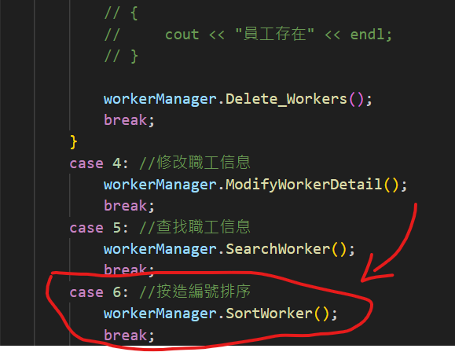

# 職工管理系統

> 如果要執行此檔案，請打開 Terminal，並進入當前資料夾，再輸入 `g++ <所有cpp檔名> -o main`

## 1、管理系統需求

職工管理系統可以用來管理公司內所有員工的信息

本教程主要利用C++來實現一個基於多態的職工管理系統


公司中職工分為三類：普通員工、經理、老闆，顯示信息時，需要顯示職工編號、職工姓名、職工崗位、以及職責

普通員工職責：完成經理交給的任務

經理職責：完成老闆交給的任務，並下發任務給員工

老闆職責：管理公司所有事務


管理系統中需要實現的功能如下：

* 退出管理程序：退出當前管理系統

- 增加職工信息：實現批量添加職工功能，將信息錄入到文件中，職工信息為：職工編號、姓名、部門編號
- 顯示職工信息：顯示公司內部所有職工的信息
- 刪除離職職工：按照編號刪除指定的職工
- 修改職工信息：按照編號修改職工個人信息
- 查找職工信息：按照職工的編號或者職工的姓名進行查找相關的人員信息
- 按照編號排序：按照職工編號，進行排序，排序規則由用戶指定
- 清空所有文檔：清空文件中記錄的所有職工信息 （清空前需要再次確認，防止誤刪）


系統界面效果圖如下：


需根據用戶不同的選擇，完成不同的功能！


## 2、創建項目

創建項目步驟如下：

- 創建新項目
- 添加文件


### 2.1 創建項目

打開vs2017後，點擊創建新項目，創建新的C++項目


填寫項目名稱以及項目路徑，點擊確定


### 2.2 添加文件

右鍵源文件，進行添加文件操作


至此，項目已創建完畢


## 3、創建管理類

​	管理類負責的內容如下：

* 與用戶的溝通菜單界面
* 對職工增刪改查的操作
* 與文件的讀寫交互


### 3.1創建文件 

在頭文件和源文件的文件夾下分別創建workerManager.h 和 workerManager.cpp文件


### 3.2 頭文件實現

在workerManager.h中設計管理類

代碼如下：

```C++
#pragma once
#include<iostream>
using namespace std;


class WorkerManager
{
public:

	//構造函數
	WorkerManager();

	//析構函數
	~WorkerManager();

};
```

### 3.3 源文件實現

在workerManager.cpp中將構造和析構函數空實現補全

```C++
#include "workerManager.h"

WorkerManager::WorkerManager()
{
}

WorkerManager::~WorkerManager()
{
}

```


至此職工管理類以創建完畢


## 4、菜單功能

功能描述：與用戶的溝通界面

### 4.1 添加成員函數

在管理類workerManager.h中添加成員函數  `void ShowMenu();`


 


### 4.2 菜單功能實現

在管理類workerManager.cpp中實現  Show_Menu()函數

```C++
//展示菜單
void  WorkManager::ShowMenu(){
	cout << "********************************************" << endl;
	cout << "*********  歡迎使用職工管理系統！ **********" << endl;
	cout << "*************  0.退出管理程式  *************" << endl;
	cout << "*************  1.增加職工信息  *************" << endl;
	cout << "*************  2.顯示職工信息  *************" << endl;
	cout << "*************  3.刪除離職職工  *************" << endl;
	cout << "*************  4.修改職工信息  *************" << endl;
	cout << "*************  5.查找職工信息  *************" << endl;
	cout << "*************  6.按造編號排序  *************" << endl;
	cout << "*************  7.清空所有文檔  *************" << endl;
	cout << "********************************************" << endl;
	cout << endl;
};
```


### 4.3 測試菜單功能

在職工管理系統.cpp中測試菜單功能

代碼：

```C++
#include<iostream>
using namespace std;
#include "workerManager.h"

int main() {

	WorkerManager workerManager;

	workerManager.ShowMenu();

	system("pause");

	return 0;
}
```

運行效果如圖：


## 5、退出功能

### 5.1  提供功能接口

在main函數中提供分支選擇，提供每個功能接口

代碼：

```C++
int main(){
    //實例化管理對象
    WorkManager workerManager;

    int choice = 0; //用來存儲用戶的選項
    while(true){

        //展示菜單
        workerManager.ShowMenu();
        cout<<"請輸入你的選擇"<<endl;
        cin>>choice;    //接受用戶的選項
        switch (choice)
        {
        case 0: //退出管理程式
            break;
        case 1: //增加職工信息
            break;
        case 2: //顯示職工信息
            break;
        case 3: //刪除離職職工
            break;
        case 4: //修改職工信息
            break;
        case 5: //查找職工信息
            break;
        case 6: //按造編號排序
            break;
        case 7: //清空所有文檔
            break;
        default:
            cout<<"輸入錯誤，請重新輸入"<<endl;
            system("cls");
            break;
        }

    }
    system("pause");
}

```


### 5.2 實現退出功能

在workerManager.h中提供退出系統的成員函數 `	void exitSystem();`

在workerManager.cpp中提供具體的功能實現

```C++
void WorkerManager::exitSystem()
{
	cout << "歡迎下次使用" << endl;
	system("pause");
	exit(0);
}
```


### 5.3測試功能

在main函數分支 0  選項中，調用退出程序的接口


運行測試效果如圖：


## 6、創建職工類

### 6.1 創建職工抽象類

職工的分類為：普通員工、經理、老闆

將三種職工抽象到一個類（worker）中,利用多態管理不同職工種類

職工的屬性為：職工編號、職工姓名、職工所在部門編號

職工的行為為：崗位職責信息描述，獲取崗位名稱


頭文件文件夾下  創建文件worker.h  文件並且添加如下代碼：

```C++
#pragma once //防止頭文件重複包含
#include<iostream>
#include<string>
using namespace std;

class Worker{
public:
    //獲取個人信息
    virtual void showInfo() = 0;

    //獲取部門名稱
    virtual string getDepartmentName()=0;
    
public:
    int m_ID;
    string m_Name;
    int position;
};
```


### 6.2 創建普通員工類

普通員工類**繼承**職工抽象類，並重寫父類中純虛函數

在頭文件和源文件的文件夾下分別創建employee.h 和 employee.cpp文件


employee.h中代碼如下：

```C++
#pragma once 
using namespace std;
#include<iostream>
#include"worker.h"

class Employee: public Worker{
public:
    //構造函數
    Employee(int m_ID,string m_Name,int position);

    //獲取個人信息
    virtual void showInfo();  // 這裡不可以用純虛函數，因為在父類已經是純虛函數了

    //獲取部門名稱
    virtual string getDepartmentName();     // 這裡不可以用純虛函數，因為在父類已經是純虛函數了
};

```

employee.cpp中代碼如下：

```C++
#include"employee.h"


//構造函數
Employee::Employee(int m_ID,string m_Name,int position)
{
    this->m_ID = m_ID;
    this->m_Name = m_Name;
    this->position = position;
};

//獲取個人信息
void Employee::showInfo(){
    cout << "員工編號：" << m_ID 
            << "\t員工姓名：" << m_Name
            << "\t員工部門ID：" << position << endl;
};

//獲取部門名稱
string Employee::getDepartmentName(){
    return "普通員工";
};
```


### 6.3 創建經理類

經理類**繼承**職工抽象類，並重寫父類中純虛函數，和普通員工類似

在頭文件和源文件的文件夾下分別創建manager.h 和 manager.cpp文件


manager.h中代碼如下：

```c++
#pragma once
#include<iostream>
#include "worker.h"
using namespace std;

class Manager: public Worker{
public:
    Manager(int m_ID, string m_name, int position);
    //獲取個人信息
    virtual void showInfo();   
    //獲取部門名稱
    virtual string getDepartmentName();  
};
```

manager.cpp中代碼如下：

```c++
#include "manager.h"

Manager::Manager(int m_ID, string m_Name, int position){
    this->m_ID = m_ID;
    this->m_Name = m_Name;
    this->position = position;
};

//獲取個人信息
void Manager::showInfo(){
    cout << "員工編號：" << m_ID 
            << "\t員工姓名：" << m_Name
            << "\t員工部門ID：" << position << endl;
};   

//獲取部門名稱
string Manager::getDepartmentName(){
    cout<<"經理"<<endl;
};  
```


### 6.4 創建老闆類

老闆類**繼承**職工抽象類，並重寫父類中純虛函數，和普通員工類似

在頭文件和源文件的文件夾下分別創建boss.h 和 boss.cpp文件


boss.h中代碼如下：

```c++
#pragma once
#include<iostream>
#include"worker.h"

//老闆類
class Boss: public Worker{
public:
    //構造函數
    Boss(int m_ID, string m_Name, int position);
    //獲取個人信息
    virtual void showInfo(); 
    //獲取部門名稱
    virtual string getDepartmentName(); 
};
```

boss.cpp中代碼如下：

```c++
#include"boss.h"

Boss::Boss(int m_ID, string m_Name, int position){
    this->m_ID = m_ID;
    this->m_Name = m_Name;
    this->position = position;
};

//獲取個人信息
void Boss::showInfo(){
    cout << "員工編號：" << m_ID 
            << "\t員工姓名：" << m_Name
            << "\t員工部門ID：" << position 
            <<"\t工作責任："<<"給manager工作事務"<< endl;
};  

//獲取部門名稱
string Boss::getDepartmentName(){
    cout<<"老闆"<<endl;

};  
```


### 6.5 測試多態

在職工管理系統.cpp中添加測試函數，並且運行能夠產生多態


測試代碼如下：

```C++
#include "worker.h"
#include "employee.h"
#include "manager.h"
#include "boss.h"


void test()
{
	Worker * worker = NULL;
	worker = new Employee(1, "張三", 1);
	worker->showInfo();
	delete worker;
	
	worker = new Manager(2, "李四", 2);
	worker->showInfo();
	delete worker;

	worker = new Boss(3, "王五", 3);
	worker->showInfo();
	delete worker;
}

```


運行效果如圖：


測試成功後，測試代碼可以註釋保留，或者選擇刪除


## 7、添加職工

功能描述：批量添加職工，並且保存到文件中

### 7.1 功能分析

分析：

用戶在批量創建時，可能會創建不同種類的職工

如果想將所有不同種類的員工都放入到一個數組中，可以將所有員工的指針維護到一個數組裡

如果想在程序中維護這個不定長度的數組，可以將數組創建到堆區，並利用Worker **的指針維護


### 7.2 功能實現

在WokerManager.h頭文件中添加成員屬性 代碼：

```C++
    //紀錄文件中的人數
    int m_worker_number_;

    //員工陣列的指針，裡面必須放worker對象指針
    Worker ** m_worker_array_ptr_;  //這是指針的指針
```


在WorkerManager構造函數中初始化屬性

```C++
WorkerManager::WorkerManager()
{
	//初始化屬性
	//初始化員工人數
	this->m_worker_number_ = 0;
	//初始化陣列指針
	this->m_worker_array_ptr_ = nullptr;
}
```


在workerManager.h中添加成員函數

```C++
    //增加員工
    void AddEmployee();
```


workerManager.cpp中實現該函數

```C++
//增加員工
void WorkManager::AddEmployee(){
	
	//設定要增加的員工數量
	cout<<"請輸入想增加的員工數量"<<endl;
	int add_employee_number = 0;	
	cin>>add_employee_number;


	// 如果你輸入的員工數量大於 0 的話，
	if(add_employee_number > 0){
		//添加
		//計算新空間大小
		// 新空間大小 = 原來的紀錄人數 + 新增人數
		int new_employee_number = this->m_worker_number_ + add_employee_number;	

		//開闢新空間
		//這個陣列的每個元素都是一個指向 Worker 類別的指標
		//總的來說，這段程式碼創建了一個可以存放多個 Worker 對象指標的陣列，並將其陣列大小指定為 new_employee_number。
		//更簡單來是一次建立了好幾個 Worker 對象指標
		Worker ** new_employee_array = new Worker*[new_employee_number];		

		//將原空間下內容拷貝到新空間下
		//意味著如果 m_worker_array_ptr_ 已經有員工了
		//那新增的員工會再從後面加上去
		if (this->m_worker_array_ptr_ != nullptr){
			for(int i = 0; i < this->m_worker_number_; i++){
				new_employee_array[i] = this->m_worker_array_ptr_[i];
			}
		}

		//批量添加新數據
		for(int i = 0; i < add_employee_number; i++){
			int id ; //員工編號
			string name; //員工姓名
			int positionSelection; //選擇職位

			cout<<"請輸入員工ID"<<endl;
			cin>>id;

			cout<<"請輸入員工姓名"<<endl;
			cin>>name;

			cout<<"請選擇職位"<<endl;
			cout<<"1. 普通員工"<<endl;
			cout<<"2. 經理"<<endl;
			cout<<"3. 老闆"<<endl;
            cin>>positionSelection;


			Worker * worker = nullptr;
			switch (positionSelection)
			{
			case 1:  //普通員工
			    worker = new Employee(id,name,1);
				break;
			case 2:  //經理
			    worker = new Manager(id,name,2);
			    break;
			case 3:  //老闆
			    worker = new Boss(id,name,3);
				break;
			default:
                break;
			}

			//將創建員工，保存到數組中
			new_employee_array[this->m_worker_number_ + i] = worker;
		};

		//釋放原有空間
		//delete[]用作於是放陣列
		delete[] this->m_worker_array_ptr_;

		//更改新陣列的指向
		this->m_worker_array_ptr_ = new_employee_array;

		//更新新的員工人數
		this->m_worker_number_ = new_employee_number;

		//判斷員工資料 csv 現在裡面不為空
		this->m_file_is_empty_ = false;

		//保存員工資料到文件中
		this->SaveEmployeeDetail();


		//顯示添加成功
		cout<<"已經成功添加"<<add_employee_number<<"名新員工！！"<<endl;


	}
	else
	{
		cout<<"輸入錯誤，請重新輸入"<<endl;
	}
	//按任意鍵後，清理螢幕
	system("pause");
	system("cls");
};
```


在WorkerManager.cpp的析構函數中，釋放堆區數據

```C++
WorkManager::~WorkManager(){
	if(this->m_worker_array_ptr_!= nullptr){
		delete[] this->m_worker_array_ptr_;
	}
};

```


### 7.3 測試添加

在main函數分支 1  選項中，調用添加職工接口


效果如圖：


至此，添加職工到程序中功能實現完畢


## 8、文件交互 - 寫文件

功能描述：對文件進行讀寫

​	在上一個添加功能中，我們只是將所有的數據添加到了內存中，一旦程序結束就無法保存了

​	因此文件管理類中需要一個與文件進行交互的功能，對於文件進行讀寫操作


### 8.1 設定文件路徑

首先我們將文件路徑，在workerManager.h中添加宏常量,並且包含頭文件 fstream

```C++
#include<fstream>
#define all_employees_detail_file_txt "all_employees_detail.txt"
```


### 8.2 成員函數聲明

在workerManager.h中類裡添加成員函數 `void save()`

```C++
//保存文件
void SaveEmployeeDetail();
```


### 8.3 保存文件功能實現

```C++
//保存文件
void WorkManager::SaveEmployeeDetail(){
	ofstream ofs;
	ofs.open(all_employees_detail_file_txt,ios::out);

	//將每個人的數據寫入到文件中
	for(int i = 0; i < this->m_worker_number_; i++)
	{
		ofs<<this->m_worker_array_ptr_[i]->m_ID<<" "
        	<<this->m_worker_array_ptr_[i]->m_Name<<" "
        	<<this->m_worker_array_ptr_[i]->position<<endl;
	}
	//關閉文件
	ofs.close();
}
```


### 8.4 保存文件功能測試

在添加職工功能中添加成功後添加保存文件函數


再次運行代碼，添加職工


同級目錄下多出文件，並且保存了添加的信息


## 9、文件交互 - 讀文件

功能描述：將文件中的內容讀取到程序中

雖然我們實現了添加職工後保存到文件的操作，但是每次開始運行程序，並沒有將文件中數據讀取到程序中

而我們的程序功能中還有清空文件的需求

因此構造函數初始化數據的情況分為三種


1. 第一次使用，文件未創建
2. 文件存在，但是數據被用戶清空
3. 文件存在，並且保存職工的所有數據


### 9.1 文件未創建

在workerManager.h中添加新的成員屬性 m_FileIsEmpty標誌文件是否為空

```C++
    //判斷文件是否為空
    bool m_file_is_empty_;
```


修改WorkerManager.cpp中構造函數代碼

```C++
//構造函數 初始化
WorkManager::WorkManager(){

	//1. 文件不存在
	ifstream ifs;
	ifs.open(all_employees_detail_file_txt,ios::in);

	if (!ifs.is_open()){
		cout<<"員工資料不存在"<<endl;

		//初始化屬性
		//初始化員工人數
		this->m_worker_number_ = 0;
		//初始化陣列指針
		this->m_worker_array_ptr_ = nullptr;
		//將 m_file_is_empty_ 改成 true
		this->m_file_is_empty_ = true;
		//關閉文件
		ifs.close();
		return;
	}
}
```


刪除文件後，測試文件不存在時初始化數據功能


### 9.2 文件存在且數據為空

在workerManager.cpp中的構造函數追加代碼：

```C++
	//2. 文件存在，但裡面為空白的
	char ch;
	ifs>>ch;
	if(ifs.eof())
	{
		cout<<"已有員工資料 txt 文件，但裡面為空白的"<<endl;
		//初始化屬性
		//初始化員工人數
		this->m_worker_number_ = 0;
		//初始化陣列指針
		this->m_worker_array_ptr_ = nullptr;
		//將 m_file_is_empty_ 改成 true
		this->m_file_is_empty_ = true;
		//關閉文件
		ifs.close();
		return;
	}
```

可再另外追加程式碼
```c++
	//2. 文件存在，但裡面為空白的
	char ch;
	ifs>>ch;
	if(ifs.eof())
	{
		cout<<"已有員工資料 txt 文件，但裡面為空白的"<<endl;
		//初始化屬性
		//初始化員工人數
		this->m_worker_number_ = 0;
		//初始化陣列指針
		this->m_worker_array_ptr_ = nullptr;
		//將 m_file_is_empty_ 改成 true
		this->m_file_is_empty_ = true;
		//關閉文件
		ifs.close();
		return;
	}

	//3. 文件存在，裡面也有員工資料
	char ch_2;
	ifs>>ch_2;
	if(!ifs.eof())
	{
		//將 m_file_is_empty_ 改成 false
		this->m_file_is_empty_ = false;

		cout<<"已有員工資料 txt 文件"<<endl;

		int employee_number_in_txt = this->GetEmployeeNumberFromTXT();
		cout<<"目前員工資料裡面有："<<employee_number_in_txt<<"個員工"<<endl;

		//初始化屬性
		//初始化員工人數
		this->m_worker_number_ = employee_number_in_txt;

		//開闢空間
		this->m_worker_array_ptr_ = new Worker * [this->m_worker_number_];
		
		//將文件中的數據存到陣列中
		this->InitEmployee();

        //測試用的程式碼，可以註釋掉，你也可以將它打開
		// for(int i=0;i<this->m_worker_number_;i++){
		// 	cout<<"員工編號："<<this->m_worker_array_ptr_[i]->m_ID
		// 		<<"\t員工姓名"<<this->m_worker_array_ptr_[i]->m_Name
		// 		<<"\t員工職位"<<this->m_worker_array_ptr_[i]->position<<endl;
		// }
	}
```


將文件創建後清空文件內容，並測試該情況下初始化功能


我們發現文件不存在或者為空清空 m_FileIsEmpty 判斷文件是否為空的標誌都為真，那何時為假？

成功添加職工後，應該更改文件不為空的標誌

在`void WorkerManager::Add_Emp() `成員函數中添加：

```C++
	//判斷員工資料 csv 現在裡面不為空
	this->m_file_is_empty_ = false;
```


### 9.3 文件存在且保存職工數據

#### 9.3.1 獲取記錄的職工人數

在workerManager.h中添加成員函數 ` int GetEmployeeNumberFromTXT();`

```C++
    //獲取紀錄文件csv中的人數
    int GetEmployeeNumberFromTXT();
```

workerManager.cpp中實現

```C++
//獲取現在在 txt 檔裡面的員工人數
int WorkManager::GetEmployeeNumberFromTXT(){

	ifstream ifs;
	ifs.open(all_employees_detail_file_txt,ios::in);

	int id;
	string name;
	int position;

	//紀錄 csv 裡面的人數用的變數
	int employee_number = 0;

	while(ifs>>id && ifs>>name && ifs>>position){
		employee_number++;
	};

	ifs.close();
	return employee_number;
}
```

在workerManager.cpp構造函數中繼續追加代碼：

```C++
		int employee_number_in_txt = this->GetEmployeeNumberFromTXT();
		cout<<"目前員工資料裡面有："<<employee_number_in_txt<<"個員工"<<endl;

		//初始化屬性
		//初始化員工人數
		this->m_worker_number_ = employee_number_in_txt;
```


手動添加一些職工數據，測試獲取職工數量函數


#### 9.3.2 初始化數組

根據職工的數據以及職工數據，初始化workerManager中的Worker ** m_worker_array_ptr_ 指針


在WorkerManager.h中添加成員函數  `void InitEmployee();`

```C++
    //初始化員工。從外部檔案導入到程式裡面，初始化程式裡面的員工資料
    void InitEmployee();
```


在WorkerManager.cpp中實現

```C++
//初始化員工。從外部檔案導入到程式裡面，初始化程式裡面的員工資料
void WorkManager::InitEmployee(){
	ifstream ifs;	//創建輸出入流對象
	ifs.open(all_employees_detail_file_txt,ios::in);	//讀取數據

    int m_ID;
    string m_Name;
    int position;

	int index = 0;
	//您需要在循環之前定義它們的作用域。這意味著您需要在循環之前聲明這些指針，
	//並將它們初始化為nullptr。然後在循環中分配內存給這些指針並使用它們，直到循環結束。
	Worker * worker = nullptr;

	while(ifs >> m_ID && ifs >> m_Name && ifs >> position){
		if(position == 1){	//普通員工
			worker = new Employee(m_ID,m_Name,position);
		}
		else if(position == 2){	//經理
			worker = new Manager(m_ID,m_Name,position);
		}
		else if(position == 3){	//老闆
			worker = new Boss(m_ID,m_Name,position);
		}

		this->m_worker_array_ptr_[index] = worker;
		index++;
	};

	ifs.close();	//關閉文件
};
```


在workerManager.cpp構造函數中追加代碼

```C++
		//開闢空間
		this->m_worker_array_ptr_ = new Worker * [this->m_worker_number_];
		
		//將文件中的數據存到陣列中
		this->InitEmployee();

        //測試用的程式碼，可以註釋掉，你也可以將它打開
		for(int i=0;i<this->m_worker_number_;i++){
			cout<<"員工編號："<<this->m_worker_array_ptr_[i]->m_ID
				<<"\t員工姓名"<<this->m_worker_array_ptr_[i]->m_Name
				<<"\t員工職位"<<this->m_worker_array_ptr_[i]->position<<endl;
		}
```


運行程序，測試從文件中獲取的數據


至此初始化數據功能完畢，測試代碼可以註釋或刪除掉！


## 10、顯示職工

功能描述：顯示當前所有職工信息

#### 10.1 顯示職工函數聲明

在workerManager.h中添加成員函數  `void Show_Emp();`

```C++
	//顯示職工
	void Show_Workers();
```


#### 10.2 顯示職工函數實現

在workerManager.cpp中實現成員函數 `void Show_Workers();`

```C++
//顯示員工的函數
void WorkManager::Show_Workers(){
	//判斷文件是否為空
	if(this->m_file_is_empty_){
        cout<<"員工資料 csv 目前裡面為空"<<endl;
    }
	else{
		for(int i = 0 ; i < m_worker_number_ ; i++){
			//利用多態調用程序接口
			this->m_worker_array_ptr_[i]->showInfo();
		}
	}
	//按任意鍵清理屏幕
	system("pause");
	system("cls");
};
```


#### 10.3 測試顯示職工

在main函數分支 2  選項中，調用顯示職工接口


測試時分別測試 文件為空和文件不為空兩種情況

測試效果：

測試1-文件不存在或者為空情況


測試2 - 文件存在且有記錄情況


測試完畢，至此，顯示所有職工信息功能實現


## 11、刪除職工

功能描述：按照職工的編號進行刪除職工操作


#### 11.1 刪除職工函數聲明

在workerManager.h中添加成員函數  `void Del_Emp();`

```C++
    //刪除員工的函數
    void Delete_Workers();
```


#### 11.2 職工是否存在函數聲明

很多功能都需要用到根據職工是否存在來進行操作如：刪除職工、修改職工、查找職工

因此添加該公告函數，以便後續調用

在workerManager.h中添加成員函數  `int Check_Exist_Worker(int worker_id);`

```C++
    //判斷員工是否存在，如果存在就返回那個員工在陣列中的位置，如果不存在就返回-1
    int Check_Exist_Worker(int worker_id);
```


#### 11.3 職工是否存在函數實現

在workerManager.cpp中實現成員函數 `int IsExist(int id);`

```C++
//判斷員工是否存在，如果存在就返回那個員工在陣列中的位置，如果不存在就返回-1
int WorkManager::Check_Exist_Worker(int worker_id){

	int index = -1;
	for(int i = 0 ; i < m_worker_number_ ; i++){
		if (this->m_worker_array_ptr_[i]->m_ID == worker_id){
			//找到員工
			index = i;
            break;
		}
	}
	return index;
};

```


#### 11.4 刪除職工函數實現

在workerManager.cpp中實現成員函數 ` void Delete_Workers();`

```C++
//刪除員工的函數
void WorkManager::Delete_Workers(){
	if(this->m_file_is_empty_)
	{
		cout<<"員工資料 csv 裡面為空，所以沒東西可以刪除"<<endl;
	}
	else
	{
		cout<<"請輸入想要刪除的員工編號"<<endl;
		int id;
		cin>>id;

		// Check_Exist_Worker()函數用法
		// 如果此id有人，就會返回id。如果沒有人，就會返回-1
		int index = this->Check_Exist_Worker(id);
		if(index != -1)	// 說明員工存在，並且刪除掉 index 位置上的員工
		{
			
			//數據前移
			for(int i = 0; i < this->m_worker_number_ - 1; i++)
            {
                this->m_worker_array_ptr_[i] = this->m_worker_array_ptr_[i + 1];
            };

			//由於刪除了一個人，所以員工總人數要減 1
			this->m_worker_number_--;	

			//數據同步到文件中
			this->SaveEmployeeDetail();
		}
		
		else
		{
			cout<<"刪除失敗,沒有此id"<<endl;
		}
	}

	//按任意鍵清理屏幕
	system("pause");
    system("cls");

};
```


#### 11.5 測試刪除職工

在main函數分支 3  選項中，調用刪除職工接口


測試1 - 刪除不存在職工情況


測試2 - 刪除存在的職工情況

刪除成功提示圖：


再次顯示所有職工信息，確保已經刪除


查看文件中信息，再次核實員工已被完全刪除


至此，刪除職工功能實現完畢！


## 12、修改職工

功能描述：能夠按照職工的編號對職工信息進行修改並保存

#### 12.1 修改職工函數聲明

在workerManager.h中添加成員函數  `void ModifyWorkerDetail();`

```C++
    //修改員工的資訊
    void ModifyWorkerDetail();
```


#### 12.2 修改職工函數實現

在workerManager.cpp中實現成員函數 ` void ModifyWorkerDetail();`

```C++
// 修改員工的資料
void WorkManager::ModifyWorkerDetail(){
	if(this->m_file_is_empty_)
	{
		cout<<"員工資料 csv 裡面為空，所以沒任何員工資訊可以修改"<<endl;
	}
	else
	{
		cout<<"你想要修改的員工是誰，請輸入他的ID"<<endl;
		int id;
		cin>>id;
		// 如果此ID有人的話，就會返回那個 ID 的陣列 index
		// 如果那個ID沒有人的話，就會返回 -1
		int index = this->Check_Exist_Worker(id);	
		delete this->m_worker_array_ptr_[index];

		if(index != -1)    // 有找到此員工
        {

            cout<<"有找到此員工，請輸入"<<endl;

			cout<<"你要新增的新 ID 為"<<endl;
            int new_id;
			cin>>new_id;

			cout<<"你要新增的新名字為"<<endl;
            string new_name;
			cin>>new_name;

			cout<<"你要新增的新職位為"<<endl;
			cout<<"1. 普通員工"<<endl;
			cout<<"2. 經理"<<endl;
			cout<<"3. 老闆"<<endl;
            int position;
			cin>>position;

			Worker * worker = nullptr;

			switch (position)
			{
			case 1:
				worker = new Employee(new_id,new_name,position);
				break;
			case 2:
				worker = new Manager(new_id,new_name,position);
				break;
			case 3:
				worker = new Boss(new_id,new_name,position);
				break;
			default:
				break;
			}

			this->m_worker_array_ptr_[index] = worker;	// ?Nworker??H??????R?????????

			cout<<"success"<<endl;

			// 將所有員工資訊存進TXT檔案裡面
			this->SaveEmployeeDetail();

		}
		else
		{
			cout<<"查無此員工"<<endl;
		}
	}
	//清理螢幕的資訊
	system("pause");
	system("cls");
};
```


#### 12.3 測試修改職工

在main函數分支 4  選項中，調用修改職工接口


測試1 - 修改不存在職工情況


測試2 - 修改存在職工情況，例如將職工 "李四" 改為 "趙四"


修改後再次查看所有職工信息，並確認修改成功


再次確認文件中信息也同步更新


至此，修改職工功能已實現！


## 13、查找職工

功能描述：提供兩種查找職工方式，一種按照職工編號，一種按照職工姓名

#### 13.1 查找職工函數聲明

在workerManager.h中添加成員函數  `void SearchWorker();`

```c++
	//查找職工
	void SearchWorker();
```


#### 13.2 查找職工函數實現

在workerManager.cpp中實現成員函數 ` void SearchWorker();`

```C++
void WorkManager::SearchWorker(){
	if (this->m_file_is_empty_)
	{
		cout<<"員工資料 csv 裡面為空，所以沒任何員工資訊可以查詢"<<endl;
	}
	else
	{
		cout<<"請輸入要查詢的方式"<<endl;
		cout<<"1. 用ID查詢"<<endl;
		cout<<"2. 用姓名查詢"<<endl;

		int selection;
		cin>>selection;

		if (selection == 1)
		{
			cout<<"請輸入要查找的ID為"<<endl;
			int id;
			cin>>id;
			int index = Check_Exist_Worker(id);
			if(index != -1)
			{
				this->m_worker_array_ptr_[index]->showInfo();
			}
			else
			{
				cout<<"查無此人"<<endl;
			}
		}
		else if (selection == 2)
		{
			cout<<"請輸入你要查找的姓名"<<endl;
			string name;
			cin >> name;
			bool flag = false;	// 如果 flag 為 false 代表沒有找到人
			for (int i = 0 ; i <  m_worker_number_ ; i++)
			{
				if (this->m_worker_array_ptr_[i]->m_Name == name)
				{
					this->m_worker_array_ptr_[i]->showInfo();
					flag = true;
				}
			}
			if (flag == false)
			{
				cout << "查無此人" << endl;
			}
		}
		else
		{
			cout<<"輸入錯誤"<<endl;
		}
	}
};
```


#### 13.3 測試查找職工

在main函數分支 5  選項中，調用查找職工接口


測試1 - 按照職工編號查找 - 查找不存在職工


測試2 - 按照職工編號查找 -  查找存在職工


測試3 - 按照職工姓名查找 - 查找不存在職工


測試4 - 按照職工姓名查找 - 查找存在職工（如果出現重名，也一併顯示，在文件中可以添加重名職工）

例如 添加兩個王五的職工，然後按照姓名查找王五


至此，查找職工功能實現完畢！


## 14、排序

功能描述：按照職工編號進行排序，排序的順序由用戶指定

#### 14.1 排序函數聲明

在workerManager.h中添加成員函數  `void SortWorker();`

```C++
	//排序職工
	void SortWorker();
```


#### 14.2 排序函數實現

在workerManager.cpp中實現成員函數 ` void SortWorker();`

```C++
void WorkManager::SortWorker()
{
	if (this->m_file_is_empty_)
	{
		cout<<"文件不存在或是紀錄為空"<<endl;
		system("pause");
		system("cls");
	}
	else
	{
		cout<<"你想要升序排列還是降序排列"<<endl;
		cout<<"1. 按照員工編號升序排列"<<endl;
		cout<<"2. 按照員工編號降序排列"<<endl;
	}
	int select;
	cin >> select;

	for (int i = 0 ; i < m_worker_number_  ; i++)
	{
		int min_or_max = i; // 聲明最小值或最大值
		for (int j = i + 1 ; j < this->m_worker_number_  ; j++)
		{
			if (select == 1)
			{
				if (this->m_worker_array_ptr_[i]->m_ID > this->m_worker_array_ptr_[j]->m_ID)
				{
					min_or_max = j;
				}
			}
			if (select == 2)
			{
				if (this->m_worker_array_ptr_[i]->m_ID < this->m_worker_array_ptr_[j]->m_ID)
				{
					min_or_max = j;
				}
			}
		}
		//判斷一開始認定的最小值或最大值 是不是 計算的最小值以及最大值
		if (min_or_max != i)
		{
			Worker * temp = this->m_worker_array_ptr_[i];
			this->m_worker_array_ptr_[i] = this->m_worker_array_ptr_[min_or_max];
			this->m_worker_array_ptr_[min_or_max] = temp;
		}
	}
	cout<<"sort sccessful"<<endl;
	this->SaveEmployeeDetail();
	this->Show_Workers();
}
```


#### 14.3 測試排序功能

在main函數分支 6  選項中，調用排序職工接口



測試：

首先我們添加一些職工，序號是無序的，例如：


測試 - 升序排序


文件同步更新


測試 - 降序排序


文件同步更新


至此，職工按照編號排序的功能實現完畢！


## 15、清空文件

功能描述：將文件中記錄數據清空


#### 15.1 清空函數聲明

在workerManager.h中添加成員函數  `void CleanFile();`

```C++
	//清空文件
	void Clean_File();
```


#### 15.2 清空函數實現

在workerManager.cpp中實現員函數 ` void CleanFile();`

```C++
void WorkManager::CleanFile(){
	cout<<"確定清空"<<endl;
	cout<<"1. 確定"<<endl;
	cout<<"或是按任意鍵返回"<<endl;

	int select;
	cin >> select;

	if (select == 1)
	{
		//清空文件
		ofstream ofs(all_employees_detail_file_txt, ios::trunc); // 刪除文件後創建
		ofs.close();

		if (this->m_worker_array_ptr_ != nullptr)
		{
			//刪除堆區的每個職工對象
			for (int i = 0 ; i < this->m_worker_number_ ; i++)
			{
				delete this->m_worker_array_ptr_[i];
				this->m_worker_array_ptr_[i] = nullptr;
			}
		}

		//刪除堆區數組的指針
		delete[] this->m_worker_array_ptr_;
		this->m_worker_array_ptr_ = nullptr;
		this->m_worker_number_ = 0;
		this->m_file_is_empty_ = true;

		cout<<"clean sccess"<<endl;
	}
	system("pause");
	system("cls");

}
```

記得在析構函數也要將數組裡面的堆區都要清空
```C++
WorkManager::~WorkManager(){
	if(this->m_worker_array_ptr_!= nullptr){
		for(int i = 0; i < this->m_worker_number_ ; i++)
		{
			if (this->m_worker_array_ptr_[i] != nullptr)
			{
				delete this->m_worker_array_ptr_[i];
			}
		}
		delete[] this->m_worker_array_ptr_;
		this->m_worker_array_ptr_ = nullptr;
	}
};
```


#### 15.3 測試清空文件

在main函數分支 7  選項中，調用清空文件接口


測試：確認清空文件


再次查看文件中數據，記錄已為空


打開文件，裡面數據已確保清空，該功能需要慎用！


隨著清空文件功能實現，本案例製作完畢  ^ _ ^  