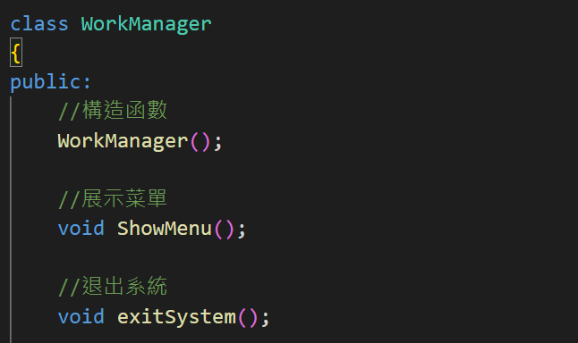
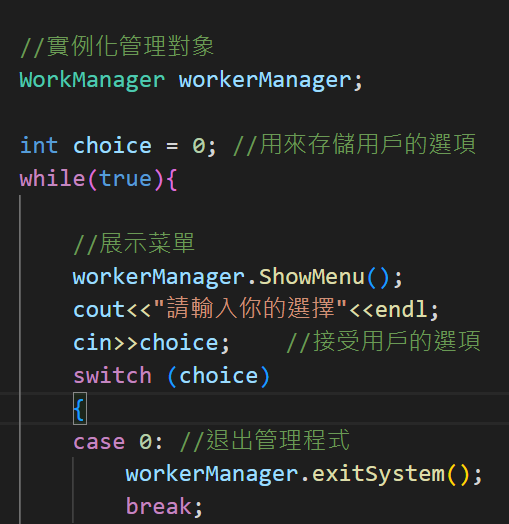
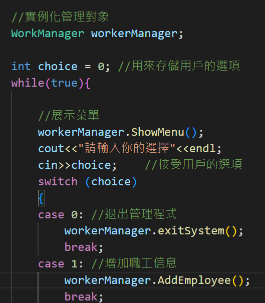
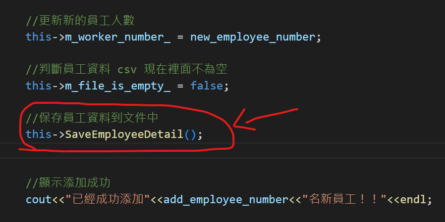
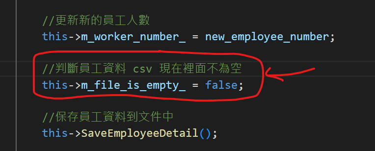
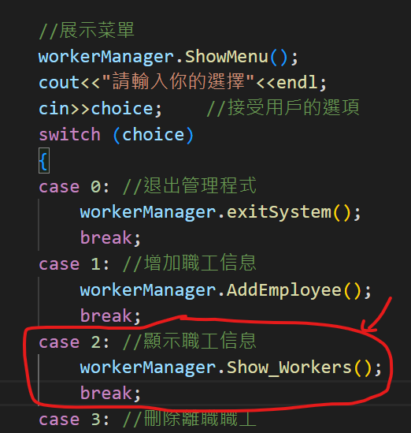
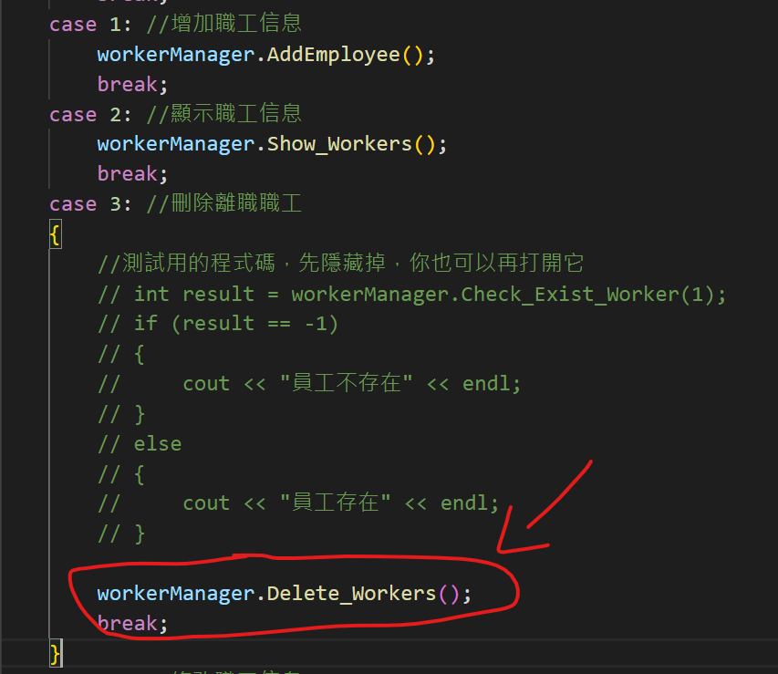
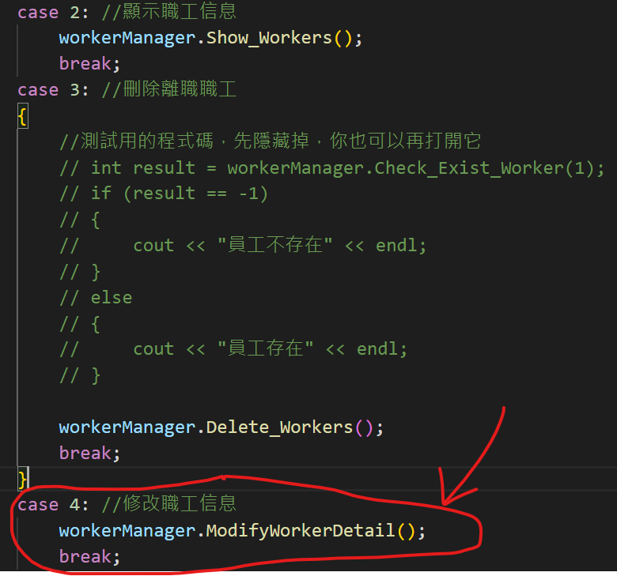
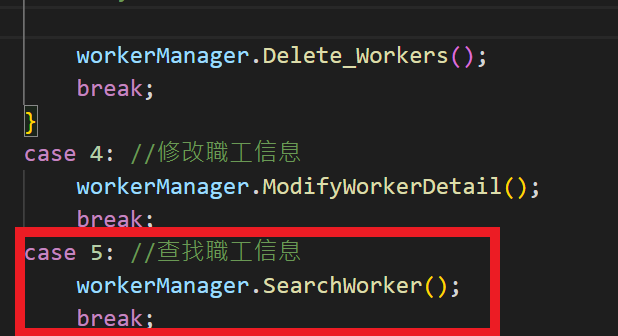

# 职工管理系统

> 如果要執行此檔案，請打開 Terminal，並進入當前資料夾，再輸入 `g++ <所有cpp檔名> -o main`

## 1、管理系统需求

职工管理系统可以用来管理公司内所有员工的信息

本教程主要利用C++来实现一个基于多态的职工管理系统


公司中职工分为三类：普通员工、经理、老板，显示信息时，需要显示职工编号、职工姓名、职工岗位、以及职责

普通员工职责：完成经理交给的任务

经理职责：完成老板交给的任务，并下发任务给员工

老板职责：管理公司所有事务


管理系统中需要实现的功能如下：

* 退出管理程序：退出当前管理系统

- 增加职工信息：实现批量添加职工功能，将信息录入到文件中，职工信息为：职工编号、姓名、部门编号
- 显示职工信息：显示公司内部所有职工的信息
- 删除离职职工：按照编号删除指定的职工
- 修改职工信息：按照编号修改职工个人信息
- 查找职工信息：按照职工的编号或者职工的姓名进行查找相关的人员信息
- 按照编号排序：按照职工编号，进行排序，排序规则由用户指定
- 清空所有文档：清空文件中记录的所有职工信息 （清空前需要再次确认，防止误删）


系统界面效果图如下：


需根据用户不同的选择，完成不同的功能！


## 2、创建项目

创建项目步骤如下：

- 创建新项目
- 添加文件


### 2.1 创建项目

打开vs2017后，点击创建新项目，创建新的C++项目


填写项目名称以及项目路径，点击确定


### 2.2 添加文件

右键源文件，进行添加文件操作


至此，项目已创建完毕


## 3、创建管理类

​	管理类负责的内容如下：

* 与用户的沟通菜单界面
* 对职工增删改查的操作
* 与文件的读写交互


### 3.1创建文件 

在头文件和源文件的文件夹下分别创建workerManager.h 和 workerManager.cpp文件


### 3.2 头文件实现

在workerManager.h中设计管理类

代码如下：

```C++
#pragma once
#include<iostream>
using namespace std;


class WorkerManager
{
public:

	//构造函数
	WorkerManager();

	//析构函数
	~WorkerManager();

};
```

### 3.3 源文件实现

在workerManager.cpp中将构造和析构函数空实现补全

```C++
#include "workerManager.h"

WorkerManager::WorkerManager()
{
}

WorkerManager::~WorkerManager()
{
}

```


至此职工管理类以创建完毕


## 4、菜单功能

功能描述：与用户的沟通界面

### 4.1 添加成员函数

在管理类workerManager.h中添加成员函数  `void ShowMenu();`



 


### 4.2 菜单功能实现

在管理类workerManager.cpp中实现  Show_Menu()函数

```C++
//展示菜單
void  WorkManager::ShowMenu(){
	cout << "********************************************" << endl;
	cout << "*********  歡迎使用職工管理系統！ **********" << endl;
	cout << "*************  0.退出管理程式  *************" << endl;
	cout << "*************  1.增加職工信息  *************" << endl;
	cout << "*************  2.顯示職工信息  *************" << endl;
	cout << "*************  3.刪除離職職工  *************" << endl;
	cout << "*************  4.修改職工信息  *************" << endl;
	cout << "*************  5.查找職工信息  *************" << endl;
	cout << "*************  6.按造編號排序  *************" << endl;
	cout << "*************  7.清空所有文檔  *************" << endl;
	cout << "********************************************" << endl;
	cout << endl;
};
```


### 4.3 测试菜单功能

在职工管理系统.cpp中测试菜单功能

代码：

```C++
#include<iostream>
using namespace std;
#include "workerManager.h"

int main() {

	WorkerManager workerManager;

	workerManager.ShowMenu();

	system("pause");

	return 0;
}
```

运行效果如图：


## 5、退出功能

### 5.1  提供功能接口

在main函数中提供分支选择，提供每个功能接口

代码：

```C++
int main(){
    //實例化管理對象
    WorkManager workerManager;

    int choice = 0; //用來存儲用戶的選項
    while(true){

        //展示菜單
        workerManager.ShowMenu();
        cout<<"請輸入你的選擇"<<endl;
        cin>>choice;    //接受用戶的選項
        switch (choice)
        {
        case 0: //退出管理程式
            break;
        case 1: //增加職工信息
            break;
        case 2: //顯示職工信息
            break;
        case 3: //刪除離職職工
            break;
        case 4: //修改職工信息
            break;
        case 5: //查找職工信息
            break;
        case 6: //按造編號排序
            break;
        case 7: //清空所有文檔
            break;
        default:
            cout<<"輸入錯誤，請重新輸入"<<endl;
            system("cls");
            break;
        }

    }
    system("pause");
}

```


### 5.2 实现退出功能

在workerManager.h中提供退出系统的成员函数 `	void exitSystem();`

在workerManager.cpp中提供具体的功能实现

```C++
void WorkerManager::exitSystem()
{
	cout << "欢迎下次使用" << endl;
	system("pause");
	exit(0);
}
```


### 5.3测试功能

在main函数分支 0  选项中，调用退出程序的接口




运行测试效果如图：


## 6、创建职工类

### 6.1 创建职工抽象类

职工的分类为：普通员工、经理、老板

将三种职工抽象到一个类（worker）中,利用多态管理不同职工种类

职工的属性为：职工编号、职工姓名、职工所在部门编号

职工的行为为：岗位职责信息描述，获取岗位名称


头文件文件夹下  创建文件worker.h  文件并且添加如下代码：

```C++
#pragma once //防止頭文件重複包含
#include<iostream>
#include<string>
using namespace std;

class Worker{
public:
    //獲取個人信息
    virtual void showInfo() = 0;

    //獲取部門名稱
    virtual string getDepartmentName()=0;
    
public:
    int m_ID;
    string m_Name;
    int position;
};
```


### 6.2 创建普通员工类

普通员工类**继承**职工抽象类，并重写父类中纯虚函数

在头文件和源文件的文件夹下分别创建employee.h 和 employee.cpp文件


employee.h中代码如下：

```C++
#pragma once 
using namespace std;
#include<iostream>
#include"worker.h"

class Employee: public Worker{
public:
    //構造函數
    Employee(int m_ID,string m_Name,int position);

    //獲取個人信息
    virtual void showInfo();  // 這裡不可以用純虛函數，因為在父類已經是純虛函數了

    //獲取部門名稱
    virtual string getDepartmentName();     // 這裡不可以用純虛函數，因為在父類已經是純虛函數了
};

```

employee.cpp中代码如下：

```C++
#include"employee.h"


//構造函數
Employee::Employee(int m_ID,string m_Name,int position)
{
    this->m_ID = m_ID;
    this->m_Name = m_Name;
    this->position = position;
};

//獲取個人信息
void Employee::showInfo(){
    cout << "員工編號：" << m_ID 
            << "\t員工姓名：" << m_Name
            << "\t員工部門ID：" << position << endl;
};

//獲取部門名稱
string Employee::getDepartmentName(){
    return "普通員工";
};
```


### 6.3 创建经理类

经理类**继承**职工抽象类，并重写父类中纯虚函数，和普通员工类似

在头文件和源文件的文件夹下分别创建manager.h 和 manager.cpp文件


manager.h中代码如下：

```c++
#pragma once
#include<iostream>
#include "worker.h"
using namespace std;

class Manager: public Worker{
public:
    Manager(int m_ID, string m_name, int position);
    //獲取個人信息
    virtual void showInfo();   
    //獲取部門名稱
    virtual string getDepartmentName();  
};
```

manager.cpp中代码如下：

```c++
#include "manager.h"

Manager::Manager(int m_ID, string m_Name, int position){
    this->m_ID = m_ID;
    this->m_Name = m_Name;
    this->position = position;
};

//獲取個人信息
void Manager::showInfo(){
    cout << "員工編號：" << m_ID 
            << "\t員工姓名：" << m_Name
            << "\t員工部門ID：" << position << endl;
};   

//獲取部門名稱
string Manager::getDepartmentName(){
    cout<<"經理"<<endl;
};  
```


### 6.4 创建老板类

老板类**继承**职工抽象类，并重写父类中纯虚函数，和普通员工类似

在头文件和源文件的文件夹下分别创建boss.h 和 boss.cpp文件


boss.h中代码如下：

```c++
#pragma once
#include<iostream>
#include"worker.h"

//老闆類
class Boss: public Worker{
public:
    //構造函數
    Boss(int m_ID, string m_Name, int position);
    //獲取個人信息
    virtual void showInfo(); 
    //獲取部門名稱
    virtual string getDepartmentName(); 
};
```

boss.cpp中代码如下：

```c++
#include"boss.h"

Boss::Boss(int m_ID, string m_Name, int position){
    this->m_ID = m_ID;
    this->m_Name = m_Name;
    this->position = position;
};

//獲取個人信息
void Boss::showInfo(){
    cout << "員工編號：" << m_ID 
            << "\t員工姓名：" << m_Name
            << "\t員工部門ID：" << position 
            <<"\t工作責任："<<"給manager工作事務"<< endl;
};  

//獲取部門名稱
string Boss::getDepartmentName(){
    cout<<"老闆"<<endl;

};  
```


### 6.5 测试多态

在职工管理系统.cpp中添加测试函数，并且运行能够产生多态


测试代码如下：

```C++
#include "worker.h"
#include "employee.h"
#include "manager.h"
#include "boss.h"


void test()
{
	Worker * worker = NULL;
	worker = new Employee(1, "张三", 1);
	worker->showInfo();
	delete worker;
	
	worker = new Manager(2, "李四", 2);
	worker->showInfo();
	delete worker;

	worker = new Boss(3, "王五", 3);
	worker->showInfo();
	delete worker;
}

```


运行效果如图：


测试成功后，测试代码可以注释保留，或者选择删除


## 7、添加职工

功能描述：批量添加职工，并且保存到文件中

### 7.1 功能分析

分析：

用户在批量创建时，可能会创建不同种类的职工

如果想将所有不同种类的员工都放入到一个数组中，可以将所有员工的指针维护到一个数组里

如果想在程序中维护这个不定长度的数组，可以将数组创建到堆区，并利用Worker **的指针维护


### 7.2 功能实现

在WokerManager.h头文件中添加成员属性 代码：

```C++
    //紀錄文件中的人數
    int m_worker_number_;

    //員工陣列的指針，裡面必須放worker對象指針
    Worker ** m_worker_array_ptr_;  //這是指針的指針
```


在WorkerManager构造函数中初始化属性

```C++
WorkerManager::WorkerManager()
{
	//初始化屬性
	//初始化員工人數
	this->m_worker_number_ = 0;
	//初始化陣列指針
	this->m_worker_array_ptr_ = nullptr;
}
```


在workerManager.h中添加成员函数

```C++
    //增加員工
    void AddEmployee();
```


workerManager.cpp中实现该函数

```C++
//增加員工
void WorkManager::AddEmployee(){
	
	//設定要增加的員工數量
	cout<<"請輸入想增加的員工數量"<<endl;
	int add_employee_number = 0;	
	cin>>add_employee_number;


	// 如果你輸入的員工數量大於 0 的話，
	if(add_employee_number > 0){
		//添加
		//計算新空間大小
		// 新空間大小 = 原來的紀錄人數 + 新增人數
		int new_employee_number = this->m_worker_number_ + add_employee_number;	

		//開闢新空間
		//這個陣列的每個元素都是一個指向 Worker 類別的指標
		//總的來說，這段程式碼創建了一個可以存放多個 Worker 對象指標的陣列，並將其陣列大小指定為 new_employee_number。
		//更簡單來是一次建立了好幾個 Worker 對象指標
		Worker ** new_employee_array = new Worker*[new_employee_number];		

		//將原空間下內容拷貝到新空間下
		//意味著如果 m_worker_array_ptr_ 已經有員工了
		//那新增的員工會再從後面加上去
		if (this->m_worker_array_ptr_ != nullptr){
			for(int i = 0; i < this->m_worker_number_; i++){
				new_employee_array[i] = this->m_worker_array_ptr_[i];
			}
		}

		//批量添加新數據
		for(int i = 0; i < add_employee_number; i++){
			int id ; //員工編號
			string name; //員工姓名
			int positionSelection; //選擇職位

			cout<<"請輸入員工ID"<<endl;
			cin>>id;

			cout<<"請輸入員工姓名"<<endl;
			cin>>name;

			cout<<"請選擇職位"<<endl;
			cout<<"1. 普通員工"<<endl;
			cout<<"2. 經理"<<endl;
			cout<<"3. 老闆"<<endl;
            cin>>positionSelection;


			Worker * worker = nullptr;
			switch (positionSelection)
			{
			case 1:  //普通員工
			    worker = new Employee(id,name,1);
				break;
			case 2:  //經理
			    worker = new Manager(id,name,2);
			    break;
			case 3:  //老闆
			    worker = new Boss(id,name,3);
				break;
			default:
                break;
			}

			//將創建員工，保存到數組中
			new_employee_array[this->m_worker_number_ + i] = worker;
		};

		//釋放原有空間
		//delete[]用作於是放陣列
		delete[] this->m_worker_array_ptr_;

		//更改新陣列的指向
		this->m_worker_array_ptr_ = new_employee_array;

		//更新新的員工人數
		this->m_worker_number_ = new_employee_number;

		//判斷員工資料 csv 現在裡面不為空
		this->m_file_is_empty_ = false;

		//保存員工資料到文件中
		this->SaveEmployeeDetail();


		//顯示添加成功
		cout<<"已經成功添加"<<add_employee_number<<"名新員工！！"<<endl;


	}
	else
	{
		cout<<"輸入錯誤，請重新輸入"<<endl;
	}
	//按任意鍵後，清理螢幕
	system("pause");
	system("cls");
};
```


在WorkerManager.cpp的析构函数中，释放堆区数据

```C++
WorkManager::~WorkManager(){
	if(this->m_worker_array_ptr_!= nullptr){
		delete[] this->m_worker_array_ptr_;
	}
};

```


### 7.3 测试添加

在main函数分支 1  选项中，调用添加职工接口



效果如图：


至此，添加职工到程序中功能实现完毕


## 8、文件交互 - 写文件

功能描述：对文件进行读写

​	在上一个添加功能中，我们只是将所有的数据添加到了内存中，一旦程序结束就无法保存了

​	因此文件管理类中需要一个与文件进行交互的功能，对于文件进行读写操作


### 8.1 设定文件路径

首先我们将文件路径，在workerManager.h中添加宏常量,并且包含头文件 fstream

```C++
#include<fstream>
#define all_employees_detail_file_txt "all_employees_detail.txt"
```


### 8.2 成员函数声明

在workerManager.h中类里添加成员函数 `void save()`

```C++
//保存文件
void SaveEmployeeDetail();
```


### 8.3 保存文件功能实现

```C++
//保存文件
void WorkManager::SaveEmployeeDetail(){
	ofstream ofs;
	ofs.open(all_employees_detail_file_txt,ios::out);

	//將每個人的數據寫入到文件中
	for(int i = 0; i < this->m_worker_number_; i++)
	{
		ofs<<this->m_worker_array_ptr_[i]->m_ID<<" "
        	<<this->m_worker_array_ptr_[i]->m_Name<<" "
        	<<this->m_worker_array_ptr_[i]->position<<endl;
	}
	//關閉文件
	ofs.close();
}
```


### 8.4 保存文件功能测试

在添加职工功能中添加成功后添加保存文件函数





再次运行代码，添加职工


同级目录下多出文件，并且保存了添加的信息


## 9、文件交互 - 读文件

功能描述：将文件中的内容读取到程序中

虽然我们实现了添加职工后保存到文件的操作，但是每次开始运行程序，并没有将文件中数据读取到程序中

而我们的程序功能中还有清空文件的需求

因此构造函数初始化数据的情况分为三种


1. 第一次使用，文件未创建
2. 文件存在，但是数据被用户清空
3. 文件存在，并且保存职工的所有数据


### 9.1 文件未创建

在workerManager.h中添加新的成员属性 m_FileIsEmpty标志文件是否为空

```C++
    //判斷文件是否為空
    bool m_file_is_empty_;
```


修改WorkerManager.cpp中构造函数代码

```C++
//構造函數 初始化
WorkManager::WorkManager(){

	//1. 文件不存在
	ifstream ifs;
	ifs.open(all_employees_detail_file_txt,ios::in);

	if (!ifs.is_open()){
		cout<<"員工資料不存在"<<endl;

		//初始化屬性
		//初始化員工人數
		this->m_worker_number_ = 0;
		//初始化陣列指針
		this->m_worker_array_ptr_ = nullptr;
		//將 m_file_is_empty_ 改成 true
		this->m_file_is_empty_ = true;
		//關閉文件
		ifs.close();
		return;
	}
}
```


删除文件后，测试文件不存在时初始化数据功能


### 9.2 文件存在且数据为空

在workerManager.cpp中的构造函数追加代码：

```C++
	//2. 文件存在，但裡面為空白的
	char ch;
	ifs>>ch;
	if(ifs.eof())
	{
		cout<<"已有員工資料 txt 文件，但裡面為空白的"<<endl;
		//初始化屬性
		//初始化員工人數
		this->m_worker_number_ = 0;
		//初始化陣列指針
		this->m_worker_array_ptr_ = nullptr;
		//將 m_file_is_empty_ 改成 true
		this->m_file_is_empty_ = true;
		//關閉文件
		ifs.close();
		return;
	}
```

可再另外追加程式碼
```c++
	//2. 文件存在，但裡面為空白的
	char ch;
	ifs>>ch;
	if(ifs.eof())
	{
		cout<<"已有員工資料 txt 文件，但裡面為空白的"<<endl;
		//初始化屬性
		//初始化員工人數
		this->m_worker_number_ = 0;
		//初始化陣列指針
		this->m_worker_array_ptr_ = nullptr;
		//將 m_file_is_empty_ 改成 true
		this->m_file_is_empty_ = true;
		//關閉文件
		ifs.close();
		return;
	}

	//3. 文件存在，裡面也有員工資料
	char ch_2;
	ifs>>ch_2;
	if(!ifs.eof())
	{
		//將 m_file_is_empty_ 改成 false
		this->m_file_is_empty_ = false;

		cout<<"已有員工資料 txt 文件"<<endl;

		int employee_number_in_txt = this->GetEmployeeNumberFromTXT();
		cout<<"目前員工資料裡面有："<<employee_number_in_txt<<"個員工"<<endl;

		//初始化屬性
		//初始化員工人數
		this->m_worker_number_ = employee_number_in_txt;

		//開闢空間
		this->m_worker_array_ptr_ = new Worker * [this->m_worker_number_];
		
		//將文件中的數據存到陣列中
		this->InitEmployee();

        //測試用的程式碼，可以註釋掉，你也可以將它打開
		// for(int i=0;i<this->m_worker_number_;i++){
		// 	cout<<"員工編號："<<this->m_worker_array_ptr_[i]->m_ID
		// 		<<"\t員工姓名"<<this->m_worker_array_ptr_[i]->m_Name
		// 		<<"\t員工職位"<<this->m_worker_array_ptr_[i]->position<<endl;
		// }
	}
```


将文件创建后清空文件内容，并测试该情况下初始化功能


我们发现文件不存在或者为空清空 m_FileIsEmpty 判断文件是否为空的标志都为真，那何时为假？

成功添加职工后，应该更改文件不为空的标志

在`void WorkerManager::Add_Emp() `成员函数中添加：

```C++
	//判斷員工資料 csv 現在裡面不為空
	this->m_file_is_empty_ = false;
```




### 9.3 文件存在且保存职工数据

#### 9.3.1 获取记录的职工人数

在workerManager.h中添加成员函数 ` int GetEmployeeNumberFromTXT();`

```C++
    //獲取紀錄文件csv中的人數
    int GetEmployeeNumberFromTXT();
```

workerManager.cpp中实现

```C++
//獲取現在在 txt 檔裡面的員工人數
int WorkManager::GetEmployeeNumberFromTXT(){

	ifstream ifs;
	ifs.open(all_employees_detail_file_txt,ios::in);

	int id;
	string name;
	int position;

	//紀錄 csv 裡面的人數用的變數
	int employee_number = 0;

	while(ifs>>id && ifs>>name && ifs>>position){
		employee_number++;
	};

	ifs.close();
	return employee_number;
}
```

在workerManager.cpp构造函数中继续追加代码：

```C++
		int employee_number_in_txt = this->GetEmployeeNumberFromTXT();
		cout<<"目前員工資料裡面有："<<employee_number_in_txt<<"個員工"<<endl;

		//初始化屬性
		//初始化員工人數
		this->m_worker_number_ = employee_number_in_txt;
```


手动添加一些职工数据，测试获取职工数量函数


#### 9.3.2 初始化数组

根据职工的数据以及职工数据，初始化workerManager中的Worker ** m_worker_array_ptr_ 指针


在WorkerManager.h中添加成员函数  `void InitEmployee();`

```C++
    //初始化員工。從外部檔案導入到程式裡面，初始化程式裡面的員工資料
    void InitEmployee();
```


在WorkerManager.cpp中实现

```C++
//初始化員工。從外部檔案導入到程式裡面，初始化程式裡面的員工資料
void WorkManager::InitEmployee(){
	ifstream ifs;	//創建輸出入流對象
	ifs.open(all_employees_detail_file_txt,ios::in);	//讀取數據

    int m_ID;
    string m_Name;
    int position;

	int index = 0;
	//您需要在循環之前定義它們的作用域。這意味著您需要在循環之前聲明這些指針，
	//並將它們初始化為nullptr。然後在循環中分配內存給這些指針並使用它們，直到循環結束。
	Worker * worker = nullptr;

	while(ifs >> m_ID && ifs >> m_Name && ifs >> position){
		if(position == 1){	//普通員工
			worker = new Employee(m_ID,m_Name,position);
		}
		else if(position == 2){	//經理
			worker = new Manager(m_ID,m_Name,position);
		}
		else if(position == 3){	//老闆
			worker = new Boss(m_ID,m_Name,position);
		}

		this->m_worker_array_ptr_[index] = worker;
		index++;
	};

	ifs.close();	//關閉文件
};
```


在workerManager.cpp构造函数中追加代码

```C++
		//開闢空間
		this->m_worker_array_ptr_ = new Worker * [this->m_worker_number_];
		
		//將文件中的數據存到陣列中
		this->InitEmployee();

        //測試用的程式碼，可以註釋掉，你也可以將它打開
		for(int i=0;i<this->m_worker_number_;i++){
			cout<<"員工編號："<<this->m_worker_array_ptr_[i]->m_ID
				<<"\t員工姓名"<<this->m_worker_array_ptr_[i]->m_Name
				<<"\t員工職位"<<this->m_worker_array_ptr_[i]->position<<endl;
		}
```


运行程序，测试从文件中获取的数据


至此初始化数据功能完毕，测试代码可以注释或删除掉！


## 10、显示职工

功能描述：显示当前所有职工信息

#### 10.1 显示职工函数声明

在workerManager.h中添加成员函数  `void Show_Emp();`

```C++
	//显示职工
	void Show_Workers();
```


#### 10.2 显示职工函数实现

在workerManager.cpp中实现成员函数 `void Show_Workers();`

```C++
//顯示員工的函數
void WorkManager::Show_Workers(){
	//判斷文件是否為空
	if(this->m_file_is_empty_){
        cout<<"員工資料 csv 目前裡面為空"<<endl;
    }
	else{
		for(int i = 0 ; i < m_worker_number_ ; i++){
			//利用多態調用程序接口
			this->m_worker_array_ptr_[i]->showInfo();
		}
	}
	//按任意鍵清理屏幕
	system("pause");
	system("cls");
};
```


#### 10.3 测试显示职工

在main函数分支 2  选项中，调用显示职工接口




测试时分别测试 文件为空和文件不为空两种情况

测试效果：

测试1-文件不存在或者为空情况


测试2 - 文件存在且有记录情况


测试完毕，至此，显示所有职工信息功能实现


## 11、删除职工

功能描述：按照职工的编号进行删除职工操作


#### 11.1 删除职工函数声明

在workerManager.h中添加成员函数  `void Del_Emp();`

```C++
    //刪除員工的函數
    void Delete_Workers();
```


#### 11.2 职工是否存在函数声明

很多功能都需要用到根据职工是否存在来进行操作如：删除职工、修改职工、查找职工

因此添加该公告函数，以便后续调用

在workerManager.h中添加成员函数  `int Check_Exist_Worker(int worker_id);`

```C++
    //判斷員工是否存在，如果存在就返回那個員工在陣列中的位置，如果不存在就返回-1
    int Check_Exist_Worker(int worker_id);
```


#### 11.3 职工是否存在函数实现

在workerManager.cpp中实现成员函数 `int IsExist(int id);`

```C++
//判斷員工是否存在，如果存在就返回那個員工在陣列中的位置，如果不存在就返回-1
int WorkManager::Check_Exist_Worker(int worker_id){

	int index = -1;
	for(int i = 0 ; i < m_worker_number_ ; i++){
		if (this->m_worker_array_ptr_[i]->m_ID == worker_id){
			//找到員工
			index = i;
            break;
		}
	}
	return index;
};

```


#### 11.4 删除职工函数实现

在workerManager.cpp中实现成员函数 ` void Delete_Workers();`

```C++
//刪除員工的函數
void WorkManager::Delete_Workers(){
	if(this->m_file_is_empty_)
	{
		cout<<"員工資料 csv 裡面為空，所以沒東西可以刪除"<<endl;
	}
	else
	{
		cout<<"請輸入想要刪除的員工編號"<<endl;
		int id;
		cin>>id;

		// Check_Exist_Worker()函數用法
		// 如果此id有人，就會返回id。如果沒有人，就會返回-1
		int index = this->Check_Exist_Worker(id);
		if(index != -1)	// 說明員工存在，並且刪除掉 index 位置上的員工
		{
			
			//數據前移
			for(int i = 0; i < this->m_worker_number_ - 1; i++)
            {
                this->m_worker_array_ptr_[i] = this->m_worker_array_ptr_[i + 1];
            };

			//由於刪除了一個人，所以員工總人數要減 1
			this->m_worker_number_--;	

			//數據同步到文件中
			this->SaveEmployeeDetail();
		}
		
		else
		{
			cout<<"刪除失敗,沒有此id"<<endl;
		}
	}

	//按任意鍵清理屏幕
	system("pause");
    system("cls");

};
```


#### 11.5 测试删除职工

在main函数分支 3  选项中，调用删除职工接口



测试1 - 删除不存在职工情况


测试2 - 删除存在的职工情况

删除成功提示图：


再次显示所有职工信息，确保已经删除


查看文件中信息，再次核实员工已被完全删除


至此，删除职工功能实现完毕！


## 12、修改职工

功能描述：能够按照职工的编号对职工信息进行修改并保存

#### 12.1 修改职工函数声明

在workerManager.h中添加成员函数  `void ModifyWorkerDetail();`

```C++
    //修改員工的資訊
    void ModifyWorkerDetail();
```


#### 12.2 修改职工函数实现

在workerManager.cpp中实现成员函数 ` void ModifyWorkerDetail();`

```C++
// 修改員工的資料
void WorkManager::ModifyWorkerDetail(){
	if(this->m_file_is_empty_)
	{
		cout<<"員工資料 csv 裡面為空，所以沒任何員工資訊可以修改"<<endl;
	}
	else
	{
		cout<<"你想要修改的員工是誰，請輸入他的ID"<<endl;
		int id;
		cin>>id;
		// 如果此ID有人的話，就會返回那個 ID 的陣列 index
		// 如果那個ID沒有人的話，就會返回 -1
		int index = this->Check_Exist_Worker(id);	
		delete this->m_worker_array_ptr_[index];

		if(index != -1)    // 有找到此員工
        {

            cout<<"有找到此員工，請輸入"<<endl;

			cout<<"你要新增的新 ID 為"<<endl;
            int new_id;
			cin>>new_id;

			cout<<"你要新增的新名字為"<<endl;
            string new_name;
			cin>>new_name;

			cout<<"你要新增的新職位為"<<endl;
			cout<<"1. 普通員工"<<endl;
			cout<<"2. 經理"<<endl;
			cout<<"3. 老闆"<<endl;
            int position;
			cin>>position;

			Worker * worker = nullptr;

			switch (position)
			{
			case 1:
				worker = new Employee(new_id,new_name,position);
				break;
			case 2:
				worker = new Manager(new_id,new_name,position);
				break;
			case 3:
				worker = new Boss(new_id,new_name,position);
				break;
			default:
				break;
			}

			this->m_worker_array_ptr_[index] = worker;	// ?Nworker??H??????R?????????

			cout<<"success"<<endl;

			// 將所有員工資訊存進TXT檔案裡面
			this->SaveEmployeeDetail();

		}
		else
		{
			cout<<"查無此員工"<<endl;
		}
	}
	//清理螢幕的資訊
	system("pause");
	system("cls");
};
```


#### 12.3 测试修改职工

在main函数分支 4  选项中，调用修改职工接口




测试1 - 修改不存在职工情况


测试2 - 修改存在职工情况，例如将职工 "李四" 改为 "赵四"


修改后再次查看所有职工信息，并确认修改成功


再次确认文件中信息也同步更新


至此，修改职工功能已实现！


## 13、查找职工

功能描述：提供两种查找职工方式，一种按照职工编号，一种按照职工姓名

#### 13.1 查找职工函数声明

在workerManager.h中添加成员函数  `void SearchWorker();`

```c++
	//查找职工
	void SearchWorker();
```


#### 13.2 查找职工函数实现

在workerManager.cpp中实现成员函数 ` void SearchWorker();`

```C++
void WorkManager::SearchWorker(){
	if (this->m_file_is_empty_)
	{
		cout<<"員工資料 csv 裡面為空，所以沒任何員工資訊可以查詢"<<endl;
	}
	else
	{
		cout<<"請輸入要查詢的方式"<<endl;
		cout<<"1. 用ID查詢"<<endl;
		cout<<"2. 用姓名查詢"<<endl;

		int selection;
		cin>>selection;

		if (selection == 1)
		{
			cout<<"請輸入要查找的ID為"<<endl;
			int id;
			cin>>id;
			int index = Check_Exist_Worker(id);
			if(index != -1)
			{
				this->m_worker_array_ptr_[index]->showInfo();
			}
			else
			{
				cout<<"查無此人"<<endl;
			}
		}
		else if (selection == 2)
		{
			cout<<"請輸入你要查找的姓名"<<endl;
			string name;
			cin >> name;
			bool flag = false;	// 如果 flag 為 false 代表沒有找到人
			for (int i = 0 ; i <  m_worker_number_ ; i++)
			{
				if (this->m_worker_array_ptr_[i]->m_Name == name)
				{
					this->m_worker_array_ptr_[i]->showInfo();
					flag = true;
				}
			}
			if (flag == false)
			{
				cout << "查無此人" << endl;
			}
		}
		else
		{
			cout<<"輸入錯誤"<<endl;
		}
	}
};
```


#### 13.3 测试查找职工

在main函数分支 5  选项中，调用查找职工接口



测试1 - 按照职工编号查找 - 查找不存在职工


测试2 - 按照职工编号查找 -  查找存在职工


测试3 - 按照职工姓名查找 - 查找不存在职工


测试4 - 按照职工姓名查找 - 查找存在职工（如果出现重名，也一并显示，在文件中可以添加重名职工）

例如 添加两个王五的职工，然后按照姓名查找王五


至此，查找职工功能实现完毕！


## 14、排序

功能描述：按照职工编号进行排序，排序的顺序由用户指定

#### 14.1 排序函数声明

在workerManager.h中添加成员函数  `void Sort_Emp();`

```C++
	//排序职工
	void Sort_Emp();
```


#### 14.2 排序函数实现

在workerManager.cpp中实现成员函数 ` void Sort_Emp();`

```C++
//排序职工
void WorkerManager::Sort_Emp()
{
	if (this->m_FileIsEmpty)
	{
		cout << "文件不存在或记录为空！" << endl;
		system("pause");
		system("cls");
	}
	else
	{
		cout << "请选择排序方式： " << endl;
		cout << "1、按职工号进行升序" << endl;
		cout << "2、按职工号进行降序" << endl;

		int select = 0;
		cin >> select;


		for (int i = 0; i < m_EmpNum; i++)
		{
			int minOrMax = i;
			for (int j = i + 1; j < m_EmpNum; j++)
			{
				if (select == 1) //升序
				{
					if (m_EmpArray[minOrMax]->m_Id > m_EmpArray[j]->m_Id)
					{
						minOrMax = j;
					}
				}
				else  //降序
				{
					if (m_EmpArray[minOrMax]->m_Id < m_EmpArray[j]->m_Id)
					{
						minOrMax = j;
					}
				}
			}

			if (i != minOrMax)
			{
				Worker * temp = m_EmpArray[i];
				m_EmpArray[i] = m_EmpArray[minOrMax];
				m_EmpArray[minOrMax] = temp;
			}

		}

		cout << "排序成功,排序后结果为：" << endl;
		this->save();
		this->Show_Emp();
	}

}
```


#### 14.3 测试排序功能

在main函数分支 6  选项中，调用排序职工接口


测试：

首先我们添加一些职工，序号是无序的，例如：


测试 - 升序排序


文件同步更新


测试 - 降序排序


文件同步更新


至此，职工按照编号排序的功能实现完毕！


## 15、清空文件

功能描述：将文件中记录数据清空


#### 15.1 清空函数声明

在workerManager.h中添加成员函数  `void Clean_File();`

```C++
	//清空文件
	void Clean_File();
```


#### 15.2 清空函数实现

在workerManager.cpp中实现员函数 ` void Clean_File();`

```C++
//清空文件
void WorkerManager::Clean_File()
{
	cout << "确认清空？" << endl;
	cout << "1、确认" << endl;
	cout << "2、返回" << endl;

	int select = 0;
	cin >> select;

	if (select == 1)
	{
		//打开模式 ios::trunc 如果存在删除文件并重新创建
		ofstream ofs(FILENAME, ios::trunc);
		ofs.close();

		if (this->m_EmpArray != NULL)
		{
            for (int i = 0; i < this->m_EmpNum; i++)
			{
				if (this->m_EmpArray[i] != NULL)
				{
					delete this->m_EmpArray[i];
				}
			}
			this->m_EmpNum = 0;
			delete[] this->m_EmpArray;
			this->m_EmpArray = NULL;
			this->m_FileIsEmpty = true;
		}
		cout << "清空成功！" << endl;
	}

	system("pause");
	system("cls");
}
```


#### 15.3 测试清空文件

在main函数分支 7  选项中，调用清空文件接口


测试：确认清空文件


再次查看文件中数据，记录已为空


打开文件，里面数据已确保清空，该功能需要慎用！


随着清空文件功能实现，本案例制作完毕  ^ _ ^  